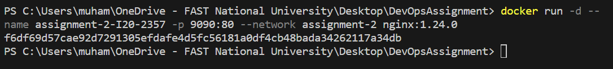

# Q1) Explain Docker Containers vs VMs

- Docker Containers:
1. OS level virtualization which means abstraction at the app layer.
2. Share host OS kernel and hardware but can have its own OS.
3. Space efficient as it takes less storage.
4. It has burstable Compute, Bustable Memory and Low resource usage since it is light weight.
5. In containers, there is "No Works on my machine" issue.
6. Containers are faster to start and stop unlike VM.

- Virtual Machines:
1. hardware level virtualization which means abstraction of physical layer.
2. share hardware but has its own OS and kernel.
3. It is heavy weight as it has complete OS, its applications, binaries, libraries etc.
4. It has static compute, static memory and high resource usage.
5. In VM's, there is "Works on my machine" issue very common as a code can work well on developers machine but donot work on client's/user's pc due to version mismatch.
6. slow to start and stop as it had to boot complete OS and its dependencies and it can cause delay.

# Q2) Write command to create a docker container in detached mode with name assignment-2-I20-2357 running on host port 9090 and container port 80 using image nginx with version 1.24.0 on a custom network named assignment-2

- docker run -d --name assignment-2-I20-2357 -p 9090:80 --network assignment-2 nginx:1.24.0

# Q3) Run the above command and add screenshot of it and share the logs

- Logs: 
docker logs assignment-2-I20-2357
/docker-entrypoint.sh: /docker-entrypoint.d/ is not empty, will attempt to perform configuration
/docker-entrypoint.sh: Looking for shell scripts in /docker-entrypoint.d/
/docker-entrypoint.sh: Launching /docker-entrypoint.d/10-listen-on-ipv6-by-default.sh
10-listen-on-ipv6-by-default.sh: info: Getting the checksum of /etc/nginx/conf.d/default.conf
10-listen-on-ipv6-by-default.sh: info: Enabled listen on IPv6 in /etc/nginx/conf.d/default.conf
/docker-entrypoint.sh: Launching /docker-entrypoint.d/20-envsubst-on-templates.sh
/docker-entrypoint.sh: Launching /docker-entrypoint.d/30-tune-worker-processes.sh
/docker-entrypoint.sh: Configuration complete; ready for start up
2023/10/06 09:49:41 [notice] 1#1: using the "epoll" event method
2023/10/06 09:49:41 [notice] 1#1: nginx/1.24.0
2023/10/06 09:49:41 [notice] 1#1: built by gcc 10.2.1 20210110 (Debian 10.2.1-6) 
2023/10/06 09:49:41 [notice] 1#1: OS: Linux 5.10.16.3-microsoft-standard-WSL2
2023/10/06 09:49:41 [notice] 1#1: getrlimit(RLIMIT_NOFILE): 1048576:1048576
2023/10/06 09:49:41 [notice] 1#1: start worker processes
2023/10/06 09:49:41 [notice] 1#1: start worker process 29
2023/10/06 09:49:41 [notice] 1#1: start worker process 30
2023/10/06 09:49:41 [notice] 1#1: start worker process 31
2023/10/06 09:49:41 [notice] 1#1: start worker process 32
2023/10/06 09:49:41 [notice] 1#1: start worker process 33
2023/10/06 09:49:41 [notice] 1#1: start worker process 34
2023/10/06 09:49:41 [notice] 1#1: start worker process 35
2023/10/06 09:49:41 [notice] 1#1: start worker process 36

