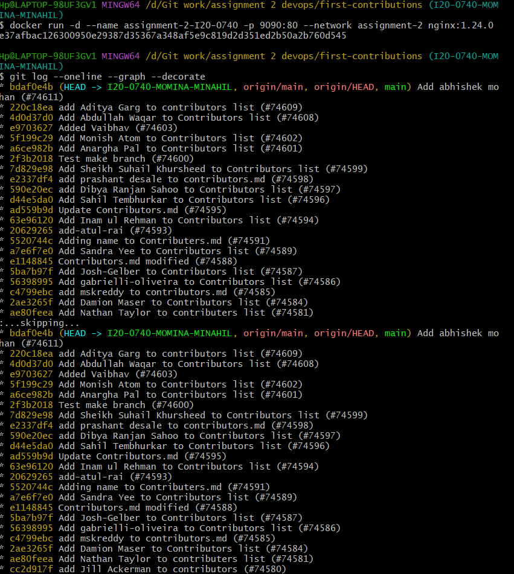

Q1: Containers vs VMs? 
Ans: VMs are hardware level virtualization while containers are OS level virtualization. With VMs, you have to install softwares and software dependencies. This creates the "works on my machine" problem. However with containers, you only have to install Docker, thus it solves the "works on my machine" problem. VMs take up more space than containers.

Q2: Write command?
Ans: docker run -d --name assignment-2-I20-0740 -p 9090:80 --network assignment-2 nginx:1.24.0

Q3: Run command and screenshot?
Ans: 
