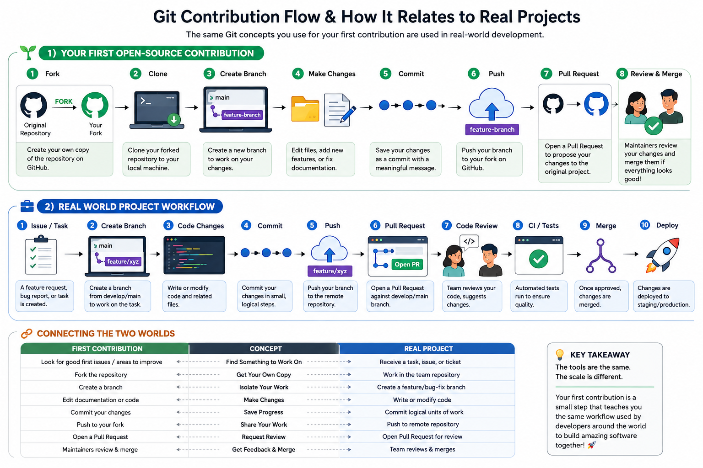

# Git Contribution Flow & How It Relates to Real Projects


The same Git concepts you use for your first contribution are used in
real-world software development.

## 1. Your First Open-Source Contribution

```text
Original Project
      |
     Fork
      v
Your GitHub Fork
      |
    Clone
      v
Your Computer
      |
  Create Branch
      |
      v
 Make Changes
      |
    Commit
      |
      v
    Push
      |
      v
Your GitHub Fork
      |
 Pull Request
      |
      v
Original Project
      |
 Review & Merge
```

### What is happening?

- **Fork** → Create your own GitHub copy of the project.
- **Clone** → Download your fork to your computer.
- **Branch** → Create an isolated place to work on your change.
- **Edit** → Make your changes.
- **Commit** → Save a checkpoint of your changes.
- **Push** → Upload your branch to your GitHub fork.
- **Pull Request** → Ask the original project maintainers to review
  your changes.
- **Review & Merge** → The maintainers review the changes and merge
  them into the project.

---

## 2. How Does This Relate to a Real Project?

The same basic Git concepts are used when working on software with a
development team.

In a real project, you will usually start with an **issue, task, bug, or
feature request**.

```text
Feature / Bug / Task
        |
        v
  Create a Branch
        |
        v
   Code Changes
        |
        v
      Commit
        |
        v
       Push
        |
        v
  Pull Request
        |
        +----------------+
        |                |
        v                v
   Code Review       Automated Tests
        |                |
        +-------+--------+
                |
                v
              Merge
                |
                v
          Main / Develop
                |
                v
            Deployment
```

### Example

Imagine you are working on an e-commerce application.

Your team gives you this task:

> **Add a discount code field to the checkout page.**

Your workflow could look like this:

```text
Task:
"Add discount code field"
        |
        v
Create branch:
feature/discount-code
        |
        v
Write the code
        |
        v
Test locally
        |
        v
Commit:
"Add discount code input to checkout"
        |
        v
Push branch
        |
        v
Create Pull Request
        |
        v
Teammate reviews the code
        |
        v
Automated tests pass
        |
        v
Changes approved
        |
        v
Merge
        |
        v
Feature becomes part of the project
```

---

## 3. Connecting Your First Contribution to a Real Project

Your first contribution is a **simplified version of a real development
workflow**.

First Contribution Real Project

---

Find something to contribute Receive a task, issue, or ticket
Fork the repository Work in the team's repository
Create a branch Create a feature or bug-fix branch
Edit files Write or modify application code
Commit changes Commit logical units of work
Push your branch Push your branch to the remote repository
Open a Pull Request Open a Pull Request for review
Maintainer reviews Developers/team review the changes
Merge Merge after approval and tests
Project is updated Application continues toward deployment

## 4. The Big Picture

Think of your first contribution as a **small-scale version of how
developers collaborate on real software projects**.

The project may become much larger and include:

- Multiple developers
- Feature and bug-fix branches
- Code reviews
- Automated tests
- CI/CD pipelines
- Issue and project tracking
- Staging environments
- Production deployment

But the fundamental Git concepts remain the same:

**Branch → Change → Commit → Push → Pull Request → Review → Merge**

> **The tools are the same. The scale is different.**

Your first contribution is not just about making a change to someone
else's repository. It is an opportunity to learn the collaboration
workflow that you will use when building and maintaining real software
projects.
