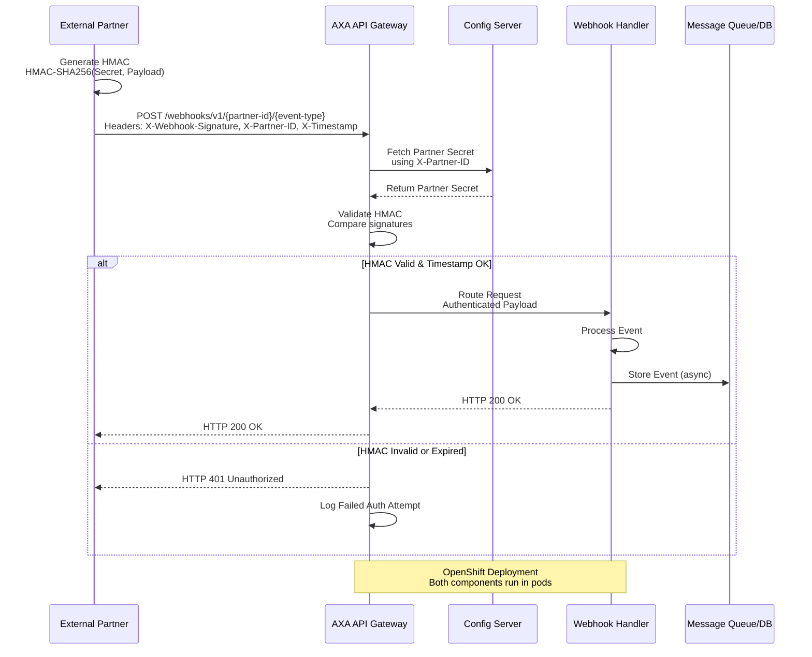

# Webhook Integration: External Partner to AXA API Gateway

## Overview
This document describes the integration flow for webhooks from external partners to the AXA API Gateway. The gateway performs HMAC (Hash-based Message Authentication Code) authentication to validate message integrity and authenticity, then routes requests to the appropriate webhook handler. Both components are deployed on Red Hat OpenShift.

## Architecture Components

### 1. External Partner System
- Sends webhook events/notifications to the AXA API Gateway.
- Uses a pre-shared secret key for HMAC signature generation.
- Sends the HMAC signature in the request headers (typically `X-Signature` or `X-Webhook-Signature`).

### 2. AXA API Gateway
- Ingress point for all webhook traffic from external partners.
- Validates incoming webhook requests using HMAC authentication.
- Performs message integrity checks.
- Routes authenticated requests to the appropriate webhook handler.
- Logs all authentication attempts and routing decisions.
- Deployed in Red Hat OpenShift (e.g., using OpenShift Service Mesh or Ingress Controller).

### 3. Webhook Handler
- Processes authenticated webhook events.
- Performs business logic based on webhook type and payload.
- Returns success/failure responses to the gateway.
- May persist events to a message queue or database.
- Deployed in Red Hat OpenShift as a containerized microservice.

### 4. Supporting Services
- **Configuration Server**: Stores partner secrets and public keys.
- **Logging & Monitoring**: ELK Stack or similar for audit trails.
- **Message Queue** (optional): For asynchronous processing (e.g., Apache Kafka, RabbitMQ).

## HMAC Authentication Flow

### Key Concept
HMAC provides both authentication and integrity assurance. The external partner and gateway share a secret key; the partner signs the request payload, and the gateway verifies the signature.

### Steps

1. **Partner Generates HMAC Signature**
   ```
   HMAC_Signature = HMAC-SHA256(Secret_Key, Request_Payload)
   ```
   Example:
   ```
   Secret = "partner-secret-key"
   Payload = request body (JSON)
   Signature = base64(HMAC-SHA256(Secret, Payload))
   ```

2. **Partner Sends Webhook Request**
   - HTTP POST to: `https://axa-gateway.openshift-domain/webhooks/v1/{partner-id}/{event-type}`
   - Headers include:
     - `Content-Type: application/json`
     - `X-Webhook-Signature: <base64-encoded-hmac-signature>`
     - `X-Partner-ID: <partner-identifier>`
     - `X-Timestamp: <ISO-8601-timestamp>`
     - `X-Request-ID: <unique-request-id>`
   - Body: JSON payload

3. **Gateway Receives Request**
   - Retrieves partner secret from configuration server using `X-Partner-ID`.
   - Extracts signature from `X-Webhook-Signature` header.

4. **Gateway Validates HMAC**
   ```
   Received_Signature = Header["X-Webhook-Signature"]
   Expected_Signature = HMAC-SHA256(Partner_Secret, Request_Body)
   
   if Received_Signature == Expected_Signature:
       Request is Authentic
   else:
       Reject with 401 Unauthorized
   ```

5. **Timestamp Validation** (optional but recommended)
   - Verify `X-Timestamp` is within acceptable time window (e.g., ±5 minutes).
   - Prevents replay attacks.

6. **Route to Handler**
   - If authentication succeeds, route to webhook handler based on event type.
   - Pass request ID and headers for traceability.

7. **Handler Processes Event**
   - Webhook handler processes the validated payload.
   - Returns HTTP 200 OK on success.
   - Returns appropriate error codes on failure (400, 500, etc.).

8. **Logging & Monitoring**
   - All authentication attempts, routing, and processing results are logged.
   - Failed authentications trigger alerts.

## Integration Flow Diagram



## OpenShift Deployment Architecture

### 1. API Gateway Deployment

**Kubernetes Manifest Example:**
```yaml
apiVersion: apps/v1
kind: Deployment
metadata:
  name: axa-api-gateway
  namespace: webhooks
spec:
  replicas: 3
  selector:
    matchLabels:
      app: axa-api-gateway
  template:
    metadata:
      labels:
        app: axa-api-gateway
    spec:
      containers:
      - name: gateway
        image: axa-registry.openshift.io/webhooks/api-gateway:latest
        ports:
        - containerPort: 8080
          name: http
        - containerPort: 8081
          name: metrics
        env:
        - name: CONFIG_SERVER_URL
          value: "http://config-server:8080"
        - name: LOG_LEVEL
          value: "INFO"
        - name: HMAC_ALGORITHM
          value: "SHA256"
        resources:
          requests:
            memory: "256Mi"
            cpu: "250m"
          limits:
            memory: "512Mi"
            cpu: "500m"
        livenessProbe:
          httpGet:
            path: /actuator/health
            port: 8081
          initialDelaySeconds: 30
          periodSeconds: 10
        readinessProbe:
          httpGet:
            path: /actuator/health/ready
            port: 8081
          initialDelaySeconds: 10
          periodSeconds: 5
```

**Service:**
```yaml
apiVersion: v1
kind: Service
metadata:
  name: axa-api-gateway-service
  namespace: webhooks
spec:
  type: ClusterIP
  selector:
    app: axa-api-gateway
  ports:
  - port: 8080
    targetPort: 8080
    name: http
  - port: 8081
    targetPort: 8081
    name: metrics
```

**Route (OpenShift Ingress):**
```yaml
apiVersion: route.openshift.io/v1
kind: Route
metadata:
  name: axa-webhook-route
  namespace: webhooks
spec:
  host: axa-gateway.openshift-domain.com
  port:
    targetPort: 8080
  tls:
    termination: edge
    insecureEdgeTerminationPolicy: Redirect
  to:
    kind: Service
    name: axa-api-gateway-service
    weight: 100
```

### 2. Webhook Handler Deployment

**Kubernetes Manifest Example:**
```yaml
apiVersion: apps/v1
kind: Deployment
metadata:
  name: webhook-handler
  namespace: webhooks
spec:
  replicas: 2
  selector:
    matchLabels:
      app: webhook-handler
  template:
    metadata:
      labels:
        app: webhook-handler
    spec:
      containers:
      - name: handler
        image: axa-registry.openshift.io/webhooks/handler:latest
        ports:
        - containerPort: 8080
          name: http
        env:
        - name: DATABASE_URL
          valueFrom:
            secretKeyRef:
              name: webhook-secrets
              key: database-url
        - name: KAFKA_BROKERS
          value: "kafka-broker-0.kafka:9092,kafka-broker-1.kafka:9092"
        resources:
          requests:
            memory: "512Mi"
            cpu: "500m"
          limits:
            memory: "1Gi"
            cpu: "1000m"
        livenessProbe:
          httpGet:
            path: /health
            port: 8080
          initialDelaySeconds: 30
          periodSeconds: 10
        readinessProbe:
          httpGet:
            path: /ready
            port: 8080
          initialDelaySeconds: 10
          periodSeconds: 5
```

**Service:**
```yaml
apiVersion: v1
kind: Service
metadata:
  name: webhook-handler-service
  namespace: webhooks
spec:
  type: ClusterIP
  selector:
    app: webhook-handler
  ports:
  - port: 8080
    targetPort: 8080
```

### 3. Configuration Server Deployment

Stores partner secrets and routing configurations.

**ConfigMap (for non-sensitive config):**
```yaml
apiVersion: v1
kind: ConfigMap
metadata:
  name: gateway-config
  namespace: webhooks
data:
  partner-routes.yaml: |
    partners:
      - id: "partner-1"
        event-types:
          - order.created
          - order.updated
        handler-service: webhook-handler-service:8080
      - id: "partner-2"
        event-types:
          - payment.processed
        handler-service: webhook-handler-service:8080
```

**Secret (for partner secrets):**
```yaml
apiVersion: v1
kind: Secret
metadata:
  name: webhook-secrets
  namespace: webhooks
type: Opaque
stringData:
  partner-1-secret: "super-secret-key-partner-1"
  partner-2-secret: "super-secret-key-partner-2"
```

## Security Considerations

### 1. **HMAC Algorithm**
- Use **SHA-256** minimum (SHA-512 for higher security).
- Avoid MD5 or SHA-1 (deprecated).

### 2. **Secret Management**
- Store partner secrets in OpenShift Secrets or HashiCorp Vault.
- Rotate secrets periodically.
- Use environment variables or mounted volumes (never hardcode).

### 3. **TLS/HTTPS**
- Enforce TLS 1.2 or higher on all webhook endpoints.
- Use valid certificates (avoid self-signed in production).
- OpenShift Route with `edge` termination handles this.

### 4. **Request Validation**
- Validate Content-Type is `application/json`.
- Implement payload size limits to prevent DoS.
- Validate timestamp to prevent replay attacks.

### 5. **Network Policies**
- Restrict ingress traffic to webhook gateway only.
- Use OpenShift NetworkPolicy to limit pod-to-pod communication.

**Example NetworkPolicy:**
```yaml
apiVersion: networking.k8s.io/v1
kind: NetworkPolicy
metadata:
  name: webhook-network-policy
  namespace: webhooks
spec:
  podSelector:
    matchLabels:
      app: webhook-handler
  policyTypes:
  - Ingress
  ingress:
  - from:
    - podSelector:
        matchLabels:
          app: axa-api-gateway
    ports:
    - protocol: TCP
      port: 8080
```

### 6. **Audit Logging**
- Log all webhook requests, authentication results, and routing decisions.
- Send logs to centralized logging (ELK, Splunk, etc.).
- Retain logs for compliance (typically 90 days minimum).

### 7. **Rate Limiting**
- Implement rate limiting per partner to prevent abuse.
- Use API Gateway or service-level rate limiting.

### 8. **DDoS Protection**
- Deploy Web Application Firewall (WAF) or use cloud provider's DDoS mitigation.
- Monitor for suspicious traffic patterns.

## Monitoring & Observability

### Key Metrics
- **Request Rate**: Webhooks received per minute per partner.
- **Authentication Success Rate**: % of requests passing HMAC validation.
- **Handler Processing Time**: Latency for webhook processing.
- **Error Rate**: Failed authentications, handler errors.
- **Queue Depth**: If using async processing.

### Logging
- **Gateway Logs**: All incoming requests, auth decisions, routing.
- **Handler Logs**: Processing steps, errors, business events.
- **Application Performance Monitoring (APM)**: Distributed tracing (OpenTelemetry, Jaeger).

### Alerts
- Alert on repeated authentication failures (possible attack).
- Alert on handler processing errors or high latency.
- Alert on unusual request patterns or volume spikes.

## Testing & Validation

### Unit Tests
- Test HMAC generation and validation logic.
- Test timestamp validation.
- Test configuration retrieval.

### Integration Tests
- Test end-to-end webhook flow with mock external partner.
- Test error scenarios (invalid HMAC, expired timestamp).
- Load test gateway and handler under expected traffic.

### Example Test (Python):
```python
import hmac
import hashlib
import json
import base64

def generate_webhook_signature(secret, payload):
    """Generate HMAC-SHA256 signature for webhook."""
    if isinstance(payload, dict):
        payload = json.dumps(payload)
    signature = hmac.new(
        secret.encode(), 
        payload.encode(), 
        hashlib.sha256
    ).digest()
    return base64.b64encode(signature).decode()

# Test
secret = "test-secret"
payload = {"order_id": "12345", "amount": 99.99}
sig = generate_webhook_signature(secret, json.dumps(payload))
print(f"Signature: {sig}")
```

## Troubleshooting

| Issue | Cause | Solution |
|-------|-------|----------|
| 401 Unauthorized | Invalid HMAC signature | Verify secret key matches on both sides; check payload encoding |
| 401 Unauthorized | Expired timestamp | Verify system clocks are synchronized; adjust time window |
| 404 Not Found | Incorrect endpoint URL | Verify route in OpenShift; check partner-id and event-type |
| 500 Internal Server Error | Handler error | Check handler logs; verify database/queue connectivity |
| Timeout | Slow handler processing | Increase timeout; optimize handler logic; add async processing |

## References
- [HMAC RFC 2104](https://tools.ietf.org/html/rfc2104)
- [Red Hat OpenShift Documentation](https://docs.openshift.com/)
- [OpenShift Route Configuration](https://docs.openshift.com/container-platform/latest/networking/routes/route-configuration.html)
- [Kubernetes Secrets](https://kubernetes.io/docs/concepts/configuration/secret/)

---

**Document Version**: 1.0  
**Last Updated**: 2026-06-11  
**Maintainer**: Platform Architecture Team
