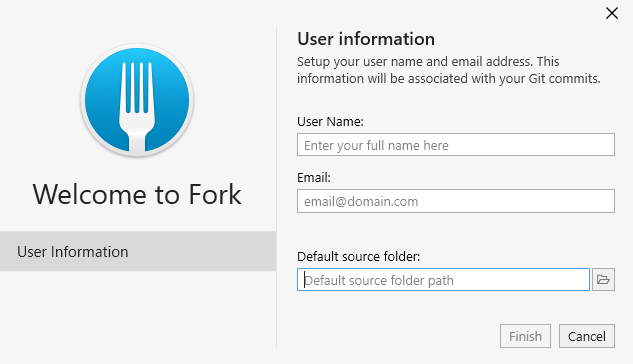
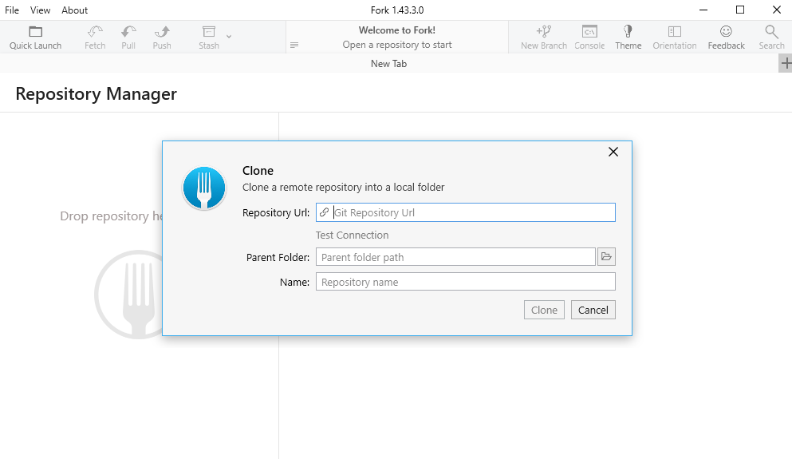
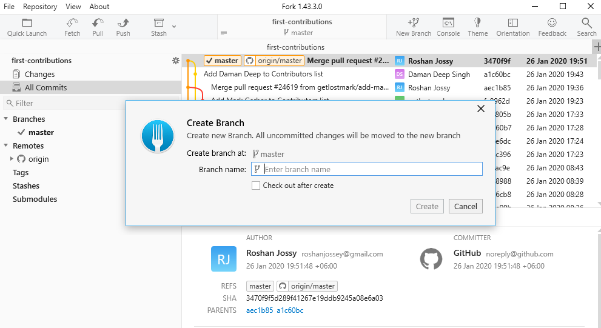
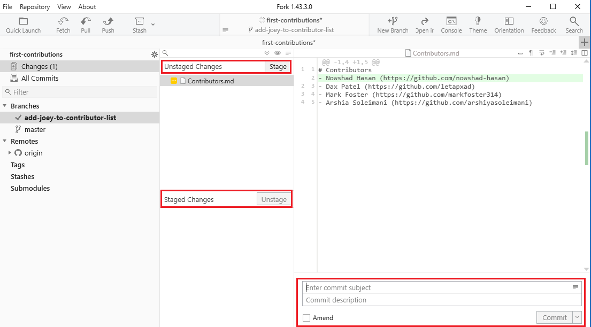

# First Contributions

||Fork|
|---|---|

It's hard. It's always hard, when you do something for the first time. Especially when you are collaborating, making mistakes isn't a comfortable thing. But open source is all about collaboration & working together. We wanted to simplify the way new open-source contributors learn & contribute for the first time.

Reading articles & watching tutorials can help, but what comes better than actually doing the stuff without messing up anything. This project aims at providing guidance & simplifying the way rookies make their first contribution. Remember the more relaxed you are, the better you learn. If you are looking for making your first contribution just follow the simple steps below. We promise you, it will be fun.

## Fork

Please note, this tutorial is for Windows. It is similar with Fork on Mac but some things may look different.

Download [Fork](https://git-fork.com/), Install and open it.

You should see the "Welcome to Fork" modal dialog.

&nbsp; <!-- Used to add an extra space below -->

Please give your name and email you want to see as author info in each commit. Additionally, you can set your default git project folder so that Fork can find all the repos together.

## Fork this repository

Fork this repo by clicking on the fork button on the top of this page.

 
 This will create of copy of this repository in your account.

## Clone the repository

The next step is to clone your repo down to your machine so you can begin making changes. Fork needs the URL of your repo, so click the "clone" button and then click the "copy to clipboard" icon on the right corner.

Then open `Fork` and go to *File -> Clone*. You'll see a box like below. *Paste* the URL you copied, in `Repository Url` box. `Name` will be automatically filled up with the repository name and specify your `Parent Folder` where you want to save the repo.

&nbsp;

**If everything is OK, then hit the Clone button.**

## Create a branch

Click the `New Branch` icon on the toolbar.

Name your branch "add-your-new-branch-name", for example: "add-joey-tribbiani". You can **tick** the checkbox to *Check out after create* to switch in your branch immediately after creating it. Then click the button **Create and Checkout**.

&nbsp;

## Make necessary changes and commit those changes

Now open `Contributors.md` file in a text editor and add your name to it, with your GitHub URL link, then save the file.

You'll see the latest changes you made here. If you're sure about the change, then hit the **Stage** button. Now the files are shown on `Staged Changes` area. After that if you're not sure about the change, you can hit the **Unstage** button to unstage it.
&nbsp;

&nbsp;

Now, write a commit message on `commit` box like `Add <your-name> to Contributors list`, for example `Add Joey Tribbiani to Contributors list`.

## Push changes to GitHub

Now you are ready to push your changes to GitHub. Click the `Push` icon on the toolbar. A modal dialog will show up. Check your local branch name and the `remote-tracking-branch` you want to create. Then hit the `Push` button.

&nbsp;

This will be pushing it to your own, forked, copy of the project.

## Submit your changes for review

If you go to your repository on github, you'll see  `Compare & pull request` button. Click on that button.

Now submit the pull request.

Soon I'll be merging all your changes into the master branch of this project. You will get a notification email once the changes have been merged.

## Where to go from here?

Congrats!  You have just completed the standard _fork -> clone -> edit -> PR_ workflow that you'll encounter often as a contributor!

Celebrate your contribution and share it with your friends and followers by going to [web app](https://roshanjossey.github.io/first-contributions/#social-share).

You could join our slack team in case you need any help or have any questions. [Join slack team](https://join.slack.com/t/firstcontributors/shared_invite/enQtMzE1MTYwNzI3ODQ0LTZiMDA2OGI2NTYyNjM1MTFiNTc4YTRhZTg4OWZjMzA0ZWZmY2UxYzVkMzI1ZmVmOWI4ODdkZWQwNTM2NDVmNjY).

Now let's get you started with contributing to other projects. We've compiled a list of projects with easy issues you can get started on. Check out [the list of projects in web app](https://roshanjossey.github.io/first-contributions/#project-list).

### [Additional material](additional-material/git_workflow_senarios/additional-material.md)

## Tutorials Using Other Tools

|||||||
|---|---|---|---|---|---|
|[Command Line](README.md)|[GitHub Desktop](github-desktop-tutorial.md)|[Visual Studio 2017](github-windows-vs2017-tutorial.md)|[GitKraken](gitkraken-tutorial.md)|[Visual Studio Code](github-windows-vs-code-tutorial.md)|[IntelliJ IDEA](github-windows-intellij-tutorial.md)

## Self-Promotion

If you liked this project, star it on [GitHub](https://github.com/Roshanjossey/first-contributions).
If you're feeling especially charitable, follow [Roshan](https://roshanjossey.github.io/) on
[Twitter](https://twitter.com/sudo__bangbang) and
[GitHub](https://github.com/roshanjossey).

