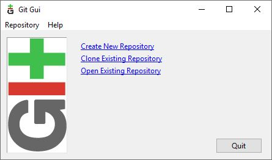
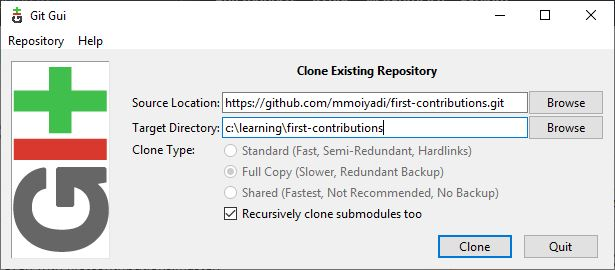
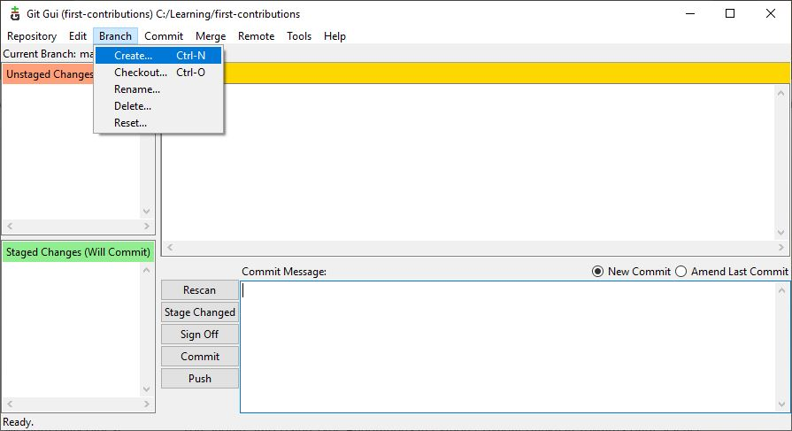
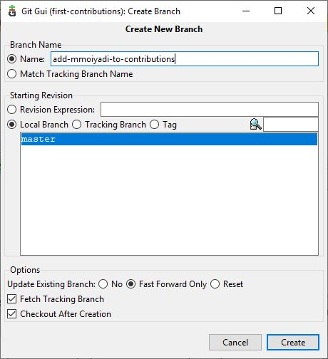
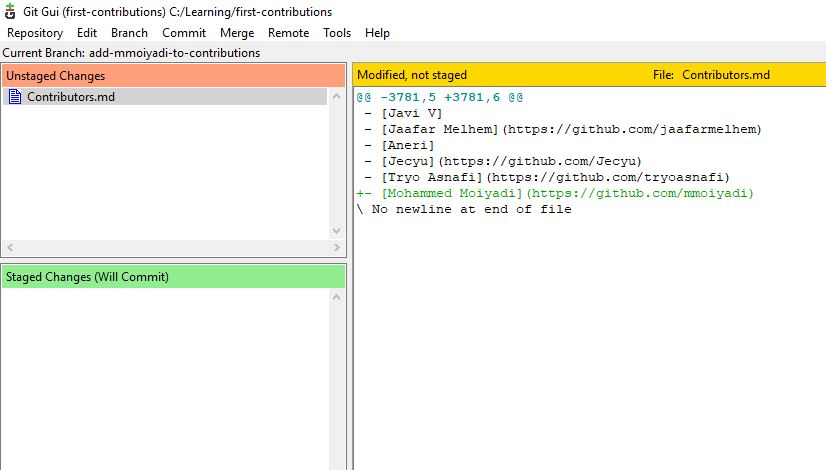
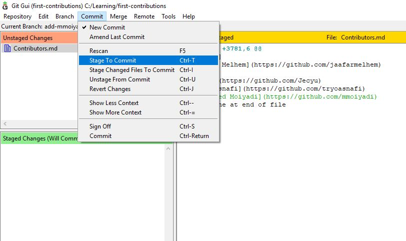
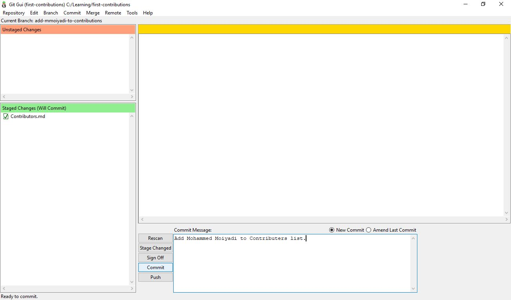
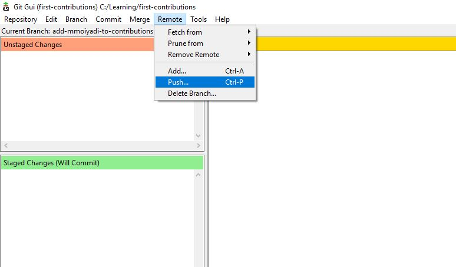
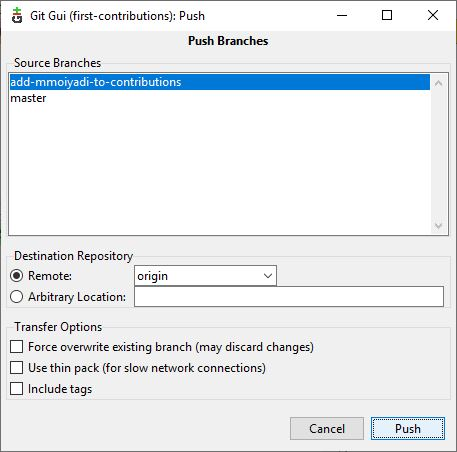
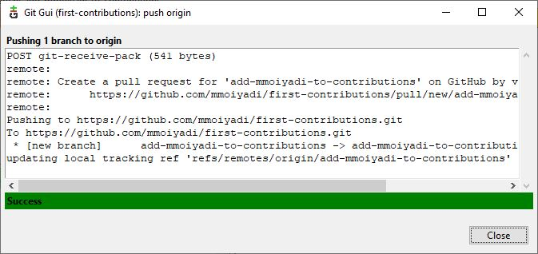

# First Contributions

||Git GUI|
|---|---|

It's hard. It's always hard, when you do something for the first time. Especially when you are collaborating, making mistakes isn't a comfortable thing. But open source is all about collaboration & working together. We wanted to simplify the way new open-source contributors learn & contribute for the first time.

Reading articles & watching tutorials can help, but what comes better than actually doing the stuff without messing up anything. This project aims at providing guidance & simplifying the way rookies make their first contribution. Remember the more relaxed you are, the better you learn. If you are looking for making your first contribution just follow the simple steps below. We promise you, it will be fun.

## Fork this repository

Fork this repo by clicking on the fork button on the top of this page.
This will create of copy of this repository in your account.  
  
   

## Git GUI
Git comes with built-in GUI tools. This tutorial provides documentation for the same.

Download [GitGUI](https://git-scm.com/downloads), Install and open it.

  

You should see the **Git Gui** modal dialog.

## Clone the repository

In Git Gui, Click on the **Clone Existing Repository** link. This will present another view to provide source and target locations.  

1) **Source Location:** You need to enter the URL of the repository that you have forked in the previous step

2) **Target Directory:** This is the physical location on your computer where this project will be saved

Once you are satisfied, click **Clone**. This will bring up the main repo browser for your repository!

## Create a branch

Click the branch button on the toolbar. This will launch a dialog to provide details about the branch to be created.

  

1) **Branch Name:** Name your branch "add-your-name-to-contribution", for example: "add-mmoiyadi-to-contribution"  

2) **Starting Revision:** Select the branch from where you want to create the branch for example: "master"

## Make necessary changes and commit those changes

Now open `Contributors.md` file in a text editor and add your name to it, with your Github URL link, then save the file.

Once you refresh Git GUI, you should be able to see and review the files that have been changed and decide what you would like to stage.

  

The modified files will appear in the **Unstaged Changes** section. In order to commit the files you need to add the modified files to **Staged Changes**. Staging is important to tell git exactly what file changes you want to associate with this commit.

To do this, select all the modified files that you want to commit from Unstaged Changes and click on **Stage To Commit** from the **Commit** toolbar option (You can also click Ctrl+T to do the same)

Once you have added all the files needed to commit to the **Staged Changes**, you can add a commit message in the bottom area of the window and click on **Commit** to make the commit

Congratulations!!! you've committed all the changes to your local copy of your branch of your fork of first-contributions.  Onward!  

## Push changes to GitHub

Now you are ready to push your changes to github. This will be pushing it to your own, forked, copy of the project. Follow the steps to push your branch up. First, click **Push...** from the **Remote** toolbar option. 

  

This will show the Push dialog. **Select** the branch you want to push. Click **Push** and this will push your commit up to Github.

  

## Submit your changes for review

If you go to your repository on github, you'll see  `Compare & pull request` button. Click on that button.

Now submit the pull request.

Soon I'll be merging all your changes into the master branch of this project. You will get a notification email once the changes have been merged.

## Where to go from here?

Congrats!  You have just completed the standard _fork -> clone -> edit -> PR_ workflow that you'll encounter often as a contributor!

Celebrate your contribution and share it with your friends and followers by going to [web app](https://roshanjossey.github.io/first-contributions/#social-share).

You could join our slack team in case you need any help or have any questions. [Join slack team](https://join.slack.com/t/firstcontributors/shared_invite/enQtMzE1MTYwNzI3ODQ0LTZiMDA2OGI2NTYyNjM1MTFiNTc4YTRhZTg4OWZjMzA0ZWZmY2UxYzVkMzI1ZmVmOWI4ODdkZWQwNTM2NDVmNjY).

Now let's get you started with contributing to other projects. We've compiled a list of projects with easy issues you can get started on. Check out [the list of projects in web app](https://roshanjossey.github.io/first-contributions/#project-list).

### [Additional material](additional-material/git_workflow_senarios/additional-material.md)

## Tutorials Using Other Tools

|||||||
|---|---|---|---|---|---|
|[Command Line](README.md)|[GitHub Desktop](github-desktop-tutorial.md)|[Visual Studio 2017](github-windows-vs2017-tutorial.md)|[GitKraken](gitkraken-tutorial.md)|[Visual Studio Code](github-windows-vs-code-tutorial.md)|[IntelliJ IDEA](github-windows-intellij-tutorial.md)|

## Self-Promotion

If you liked this project, star it on [GitHub](https://github.com/Roshanjossey/first-contributions).
If you're feeling especially charitable, follow [Roshan](https://roshanjossey.github.io/) on
[Twitter](https://twitter.com/sudo__bangbang) and
[GitHub](https://github.com/roshanjossey).

