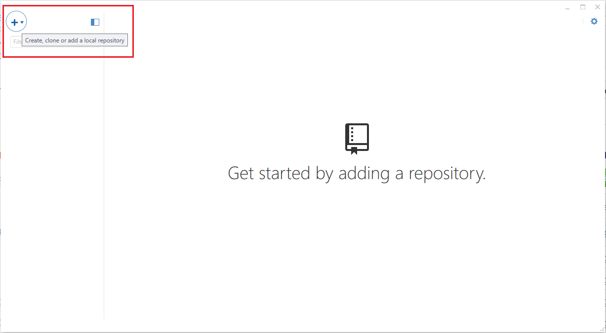
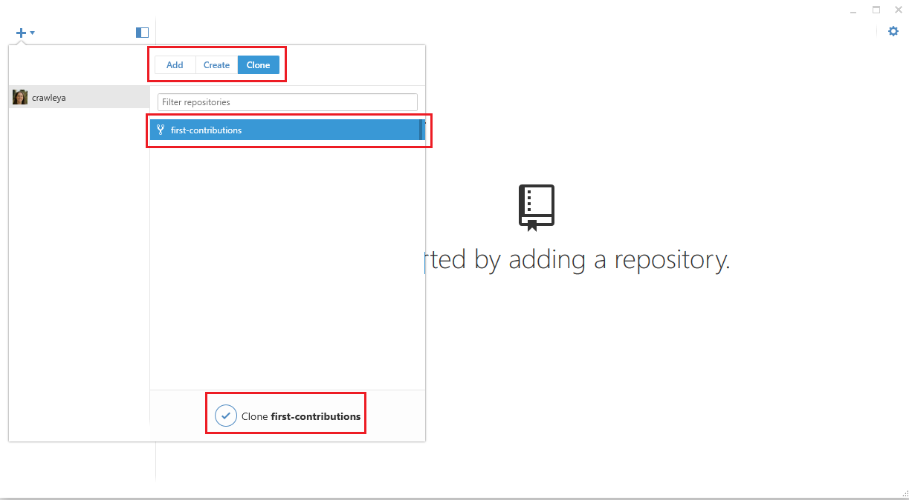
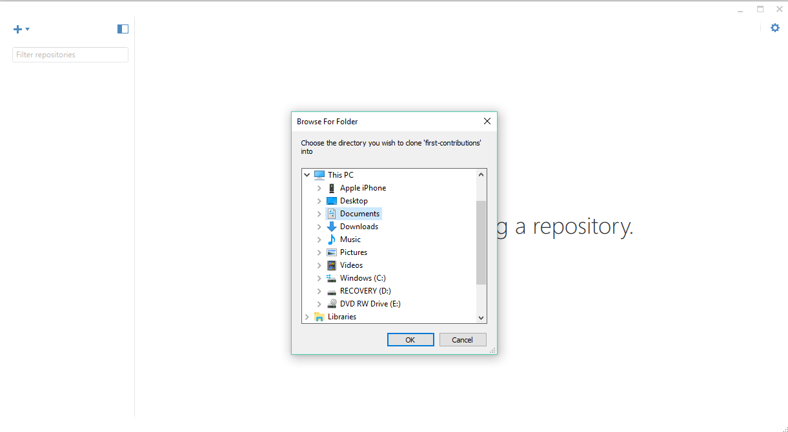
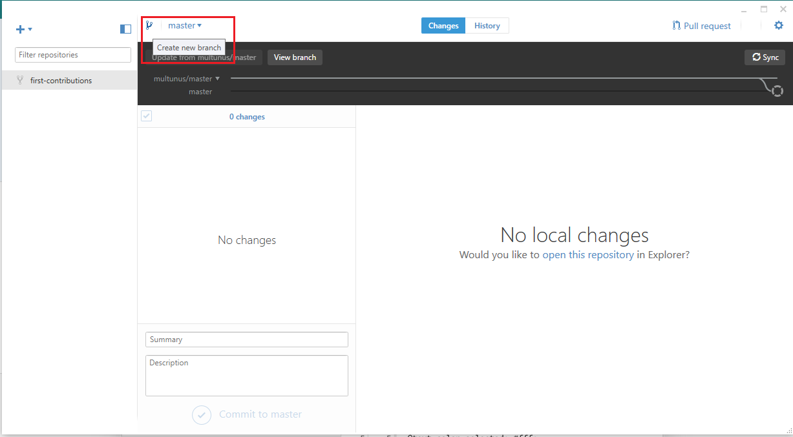
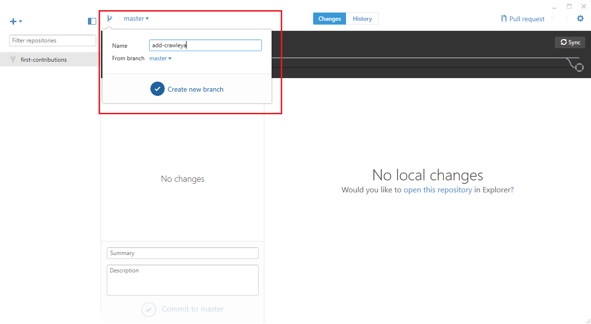
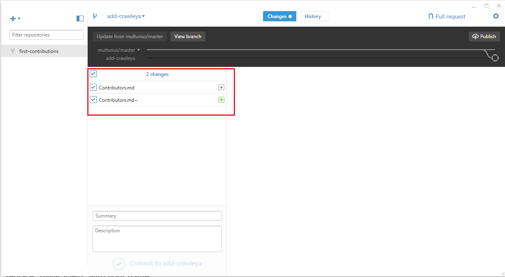
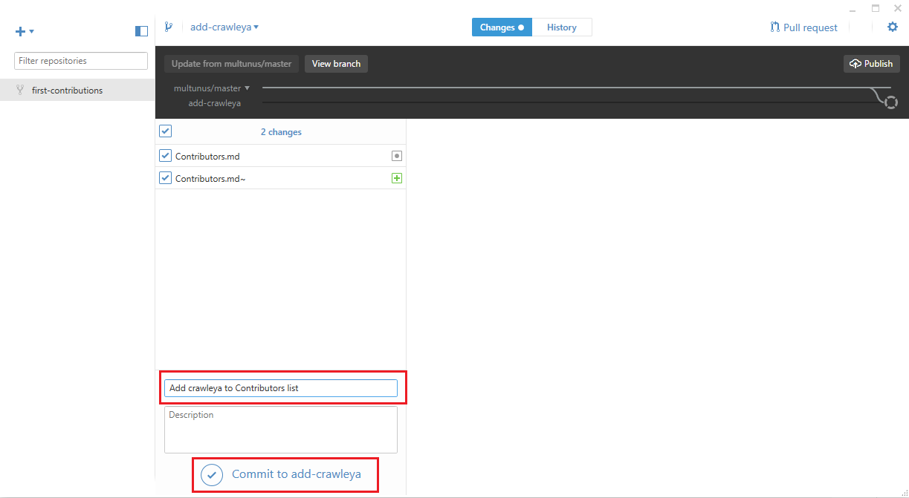
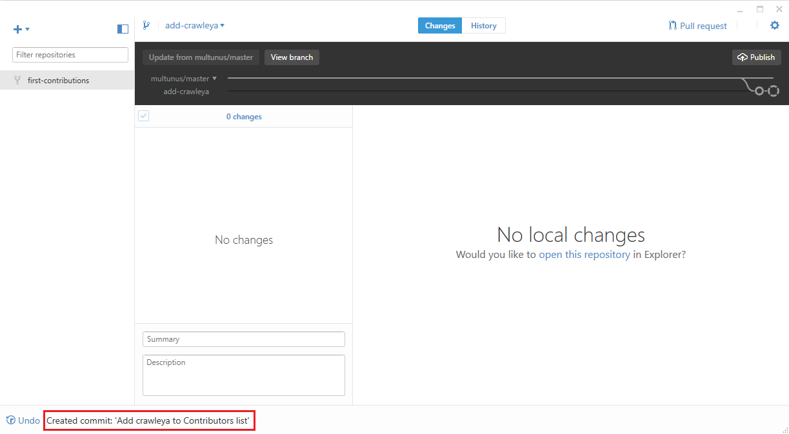
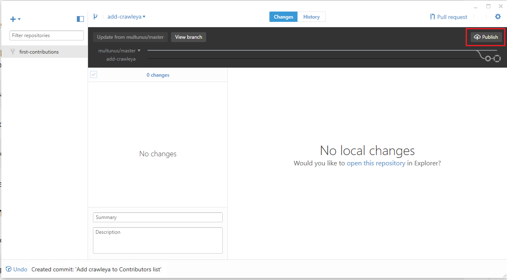

# First Contributions

||GitHub Desktop Edition|
|---|---|

It's hard. It's always hard the first time you do something. Especially when you are collaborating, making mistakes isn't a comfortable thing. But open source is all about collaboration & working together. We wanted to simplify the way new open-source contributors learn & contribute for the first time.

Reading articles & watching tutorials can help, but what comes better than actually doing the stuff without messing up anything. This project aims at providing guidance & simplifying the way rookies make their first contribution. Remember the more relaxed you are, the better you learn. If you are looking for making your first contribution just follow the simple steps below. We promise you, it will be fun.

If you don't have GitHub Desktop on your machine, [install it](https://desktop.github.com/).

## Fork this repository

Fork this repo by clicking on the fork button on the top of this page.
This will create of copy of this repository in your account.

## Clone the repository

Now clone this repo to your machine.

Open the GitHub Desktop app and click on the `+` on the top left.

If it is not already selected, click on `Clone`. Then choose first-contributions and then click on `Clone first-contributions`

Choose the directory on your machine you would like to clone first-contributions into 

Now you have copied the contents of the first-contributions repository in github to your computer.

## Create a branch

Now create a branch by clicking on the branch icon at the top left:

Name your branch add-your-name. For example, add-crawleya

Click on `Create new branch`

## Make necessary changes and commit those changes

Now open `Contributors.md` file in a text editor and add your name to it, then save the file. 

You can see that there are changes to Contributors.md and they have been added.

Now commit those changes:

Write the message "Add `<your-name>` to Contributors list" in the *summary* field

Replace `<your-name>` with your name

Click on the button that says `Commit to add-your-name`

At the bottom, you can see that the commit has been created.

## Push changes to github

Click the `Publish` button on the top right.

## Submit your changes for review

If you go to your repository on github, you'll see  `Compare & pull request` button. click on that button.

Now submit the pull request.

Soon I'll be merging all your changes into the master branch of this project. You will get a notification email once the changes have been merged.

## Where to go from here?

Congrats!  You just completed the standard _fork -> clone -> edit -> PR_ workflow that you'll encounter often as a contributor!

Celebrate your contribution and share it with your friends and followers by going to [web app](https://roshanjossey.github.io/first-contributions/#social-share).

You could join our slack team in case you need any help or have any questions. [Join slack team](https://join.slack.com/t/firstcontributors/shared_invite/enQtMzE1MTYwNzI3ODQ0LTZiMDA2OGI2NTYyNjM1MTFiNTc4YTRhZTg4OWZjMzA0ZWZmY2UxYzVkMzI1ZmVmOWI4ODdkZWQwNTM2NDVmNjY).

Now let's get you started with contributing to other projects. We've compiled a list of projects with easy issues you can get started on. Check out [the list of projects in web app](https://roshanjossey.github.io/first-contributions/#project-list).

### [Additional material](additional-material/git_workflow_senarios/additional-material.md)

## Tutorials Using Other Tools

||||
|---|---|---|
|[Command Line](README.md)|[Visual Studio 2017](github-windows-vs2017-tutorial.md)|[GitKraken](gitkraken-tutorial.md)|

## Self-Promotion

If you liked this project, star it on [GitHub](https://github.com/Roshanjossey/first-contributions).
If you're feeling especially charitable, follow [Roshan](https://roshanjossey.github.io/) on
[Twitter](https://twitter.com/sudo__bangbang) and
[GitHub](https://github.com/roshanjossey).

