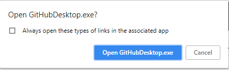
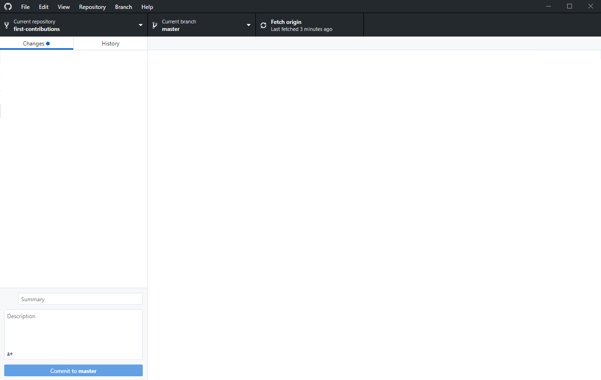
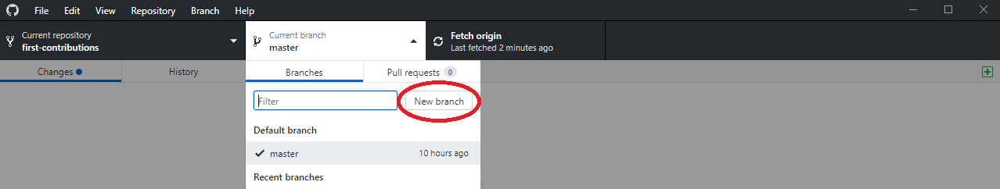
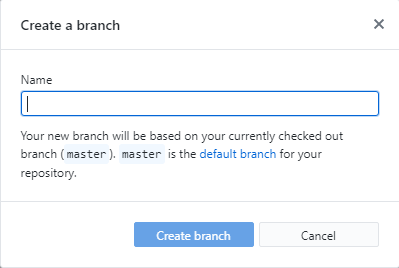
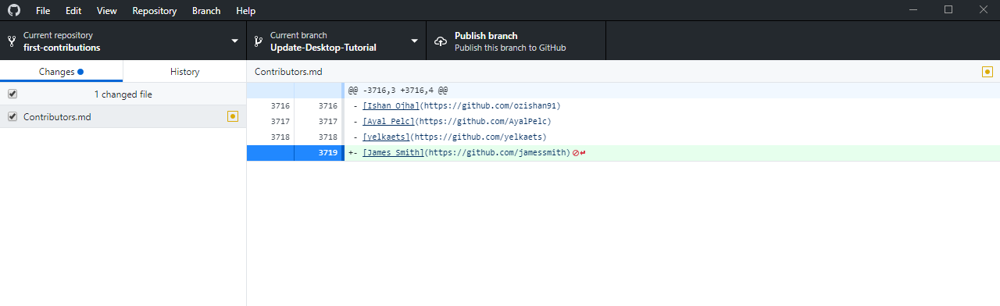
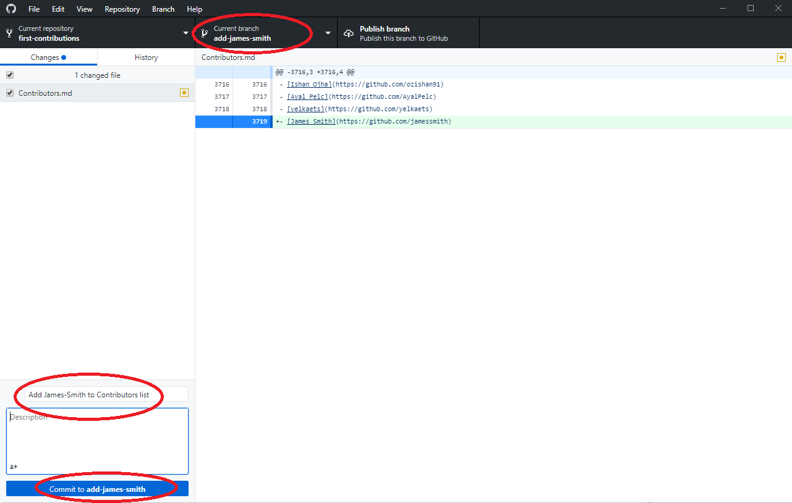
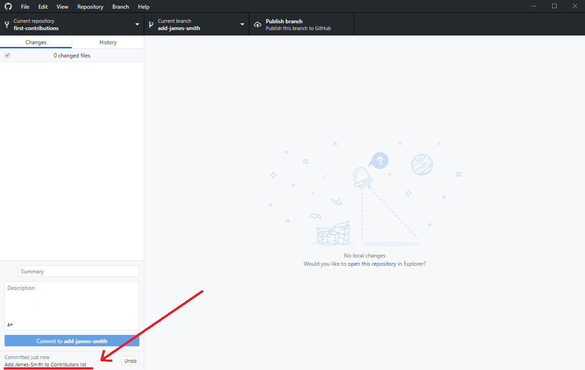
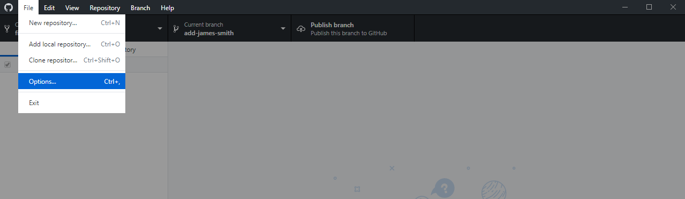
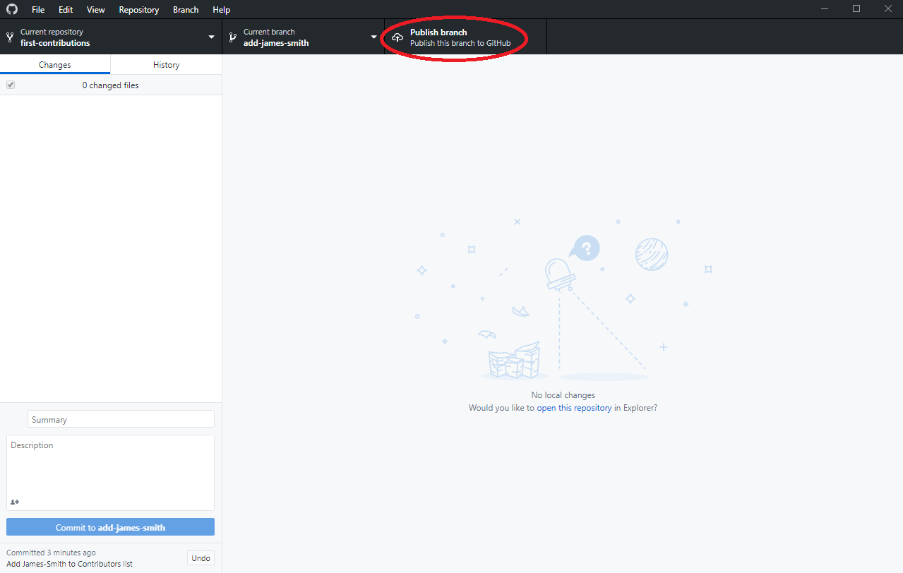

# First Contributions

||GitHub Desktop Edition|
|---|---|

É difícil. É sempre difícil a primeira vez que você faz alguma coisa. Especialmente quando você está colaborando, cometer erros não é algo confortável. Mas o open source é sobre colaboração e trabalho em enquipe. Queríamos simplificar a maneira como novos colaboradores de open source aprendem e contribuem pela primeira vez.

Ler artigos e assistir a tutoriais pode ajudar, mas o que vem melhor do que realmente fazer as coisas sem atrapalhar nada. Este projeto visa fornecer orientação e simplificar a maneira pela qual os novatos fazem sua primeira contribuição. Lembre-se que quanto mais relaxado você estiver, melhor você aprende. Se você está procurando por sua primeira contribuição, siga os passos abaixo. Nós prometemos a você, será divertido.

Se você não tem ainda o GitHub Desktop em seu computador, [install it](https://desktop.github.com/).

Se você estiver usando uma versão do GitHub Desktop anterior a 1.0, [refer this tutorial](github-desktop-old-version-tutorial.md).

## Faça um Fork desse repositório

Fork este repositório clicando no botão do Fork no canto superior direito desta página.
Isso criará uma cópia desse repositório na sua conta.

## Clone o repositório

Agora clone esse repositório no seu computador .

IMPORTANTE: NÃO CLONE O REPOSITORIO ORIGINAL. Vá para o seu Fork e clone-o.

Para clonar o repositório, clique em "Clone or Download" e depois clique em "Open in Desktop".

Uma janela pop up vai se abrir. Click em "Open GitHubDesktop"

Depois de clicar em "Abrir GitHubDesktop" o conteúdo será baixado para o seu computador.

Agora você copiou o conteúdo do repositório de primeiras contribuições no github para o seu computador.

## Create a branch

Now create a branch by clicking on the "Current branch" icon at the top and then click on "New branch":
Agora crie uma "branch" clicando no ícone "Current branch" no topo e depois clique em "New branch":

Dê um nome à sua branch <add-your-name>. For example, "add-james-smith"

Click em `Create branch`

##Faça as alterações necessárias e confirme essas alterações (commit)

Agora abra o arquivo `Contributors.md` em um editor de texto, desça até a parte inferior da página, adicione seu nome a ele e salve o arquivo.

Exemplo: Se seu nome é James Smith, deve ser assim:

\[James Smith](https://github.com/jamessmith)

Você pode ver que há alterações no Contributors.md e elas foram adicionadas ao Github Desktop.

Agora, commit essas mudanças:

Escreva a mensagem "Add `<your-name>` to Contributors list" no espaço *summary*

Subistitua `<your-name>` peloi seu nome

Escreva a mensagem "Add ` <your-name> `à lista de contribuidores" no campo *summary*

Substitua `<your-name>` com seu nome

Click no botão que diz `Commit to add-your-name`

Na parte inferior, você pode ver que o commit foi criado.

## Push as mudanças para o github

Clique em File->Options e entre no Github.com. Digite seu nome de usuário e senha do Github.

Clique no botão`Publish` no canto superior direito.

## Envie suas mudanças para serem analisadas

Se você for ao seu repositório no github, você verá o botão `Compare & pull request`. clique nesse botão.

Agora, solicite o pull request.

Em breve estarei juntando todas as suas alterações na ramificação principal deste projeto. Você receberá um e-mail de notificação assim que as alterações forem mescladas(merged).

## Para onde ir agora ?

Parabéns! Você acabou de completar o fluxo de trabalho basico _fork -> clone -> edit -> PR_ que você encontrará frequentemente como colaborador!

Comemore sua contribuição e compartilhe-a com seus amigos e seguidores indo até [web app](https://roshanjossey.github.io/first-contributions/#social-share).

Você pode se juntar nosso slack caso de precise de alguma ajuda ou tiver alguma dúvida. [Join slack team](https://join.slack.com/t/firstcontributors/shared_invite/enQtMzE1MTYwNzI3ODQ0LTZiMDA2OGI2NTYyNjM1MTFiNTc4YTRhZTg4OWZjMzA0ZWZmY2UxYzVkMzI1ZmVmOWI4ODdkZWQwNTM2NDVmNjY).

Agora vamos começar contribuindo com outros projetos. Nós compilamos uma lista de projetos com problemas fáceis que você pode começar. Confira [the list of projects in web app](https://roshanjossey.github.io/first-contributions/#project-list).

### [Additional material](additional-material/git_workflow_senarios/additional-material.md)

## Tutorials Using Other Tools

|||||
|---|---|---|---|
|[Command Line](README.md)|[Visual Studio 2017](github-windows-vs2017-tutorial.md)|[GitKraken](gitkraken-tutorial.md)|[Visual Studio Code](github-windows-vs-code-tutorial.md)|

## Self-Promotion

Se você gostou deste projeto, favorite-o com um estrela no  [GitHub](https://github.com/Roshanjossey/first-contributions).
Se estiver se sentindo especialmente caridoso, siga  [Roshan](https://roshanjossey.github.io/) no
[Twitter](https://twitter.com/sudo__bangbang) e
[GitHub](https://github.com/roshanjossey).

