[](https://github.com/ellerbrock/open-source-badges/)
[](https://join.slack.com/t/firstcontributors/shared_invite/enQtMzE1MTYwNzI3ODQ0LTZiMDA2OGI2NTYyNjM1MTFiNTc4YTRhZTg4OWZjMzA0ZWZmY2UxYzVkMzI1ZmVmOWI4ODdkZWQwNTM2NDVmNjY)
[](https://opensource.org/licenses/MIT)
[](https://www.codetriage.com/roshanjossey/first-contributions)

# First Contributions
||JetBrains PyCharm
|-----|-----|

It's hard. It's always hard the first time you do something. Especially when you are collaborating, making mistakes isn't a comfortable thing. But open source is all about collaboration & working together. We wanted to simplify the way new open-source contributors learn & contribute for the first time.

Reading articles & watching tutorials can help, but what comes better than actually doing the stuff without messing up anything. This project aims at providing guidance & simplifying the way rookies make their first contribution. Remember the more relaxed you are, the better you learn. If you are looking for making your first contribution just follow the simple steps below. We promise you, it will be fun.

If you don't have JetBrains PyCharm on your machine, [install it](https://www.jetbrains.com/pycharm/).

**Notice:** This tutorial was made using JetBrains PyCharm Community Edition (Version 2019.1.3) on a Windows 10 machine. These may differ on other operating systems (macOS/Linux).

## Fork this repository


Fork this repo by clicking on the fork button on the top right of this page. This will create of copy of this repository in your GitHub account.

GitHub keeps track of the relationship between your repo and the one you have forked it from.  You can think of your repo as a working copy.

Most top-level GitHub repos (i.e. ones not forked from any other repo) have a small core team of people who can directly commit changes.  All other contributors must fork the repo and make changes in the fork, then create a Pull Request to ask for their changes to be merged back into the top-level repo. If the top-level repo administrator likes the changes they will be merged and you will gain instant fame and fortune!  More on how to do that later.

## Clone your repository


The next step is to clone your repo down to your machine so you can begin making changes. JetBrains PyCharm needs the URL of your repo, so click the "clone" button and then click the "copy to clipboard" icon.

**CAREFUL:** One mistake that new contributors often make is to clone the repo you forked *from* rather than cloning your repo.  Check your browser's address bar and make sure you are cloning your repo.

## Jetbrains PyCharm

Open Jetbrains PyCharm and click in "Check out from Version Control".

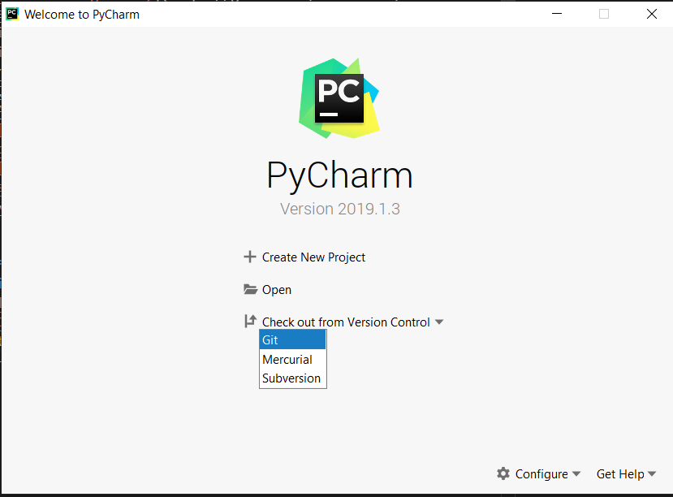

We need to Log in on our GitHub account to able to clone our repository to work with it.


In URL list we go to choose the first-contributions repository and click in "Clone".

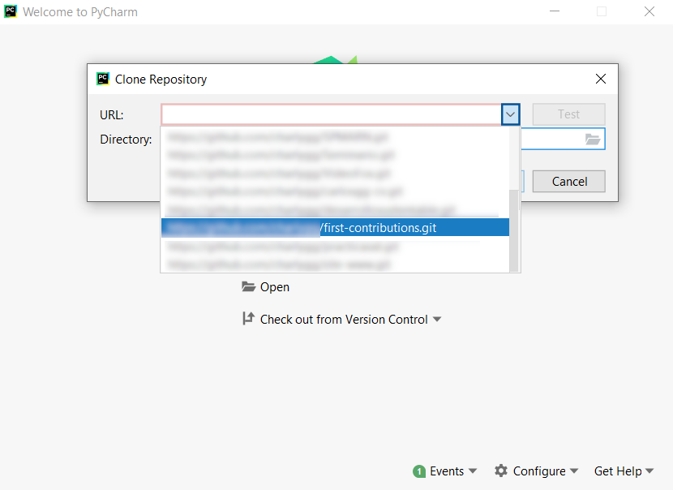

Click en Yes to open Default Project Directory.

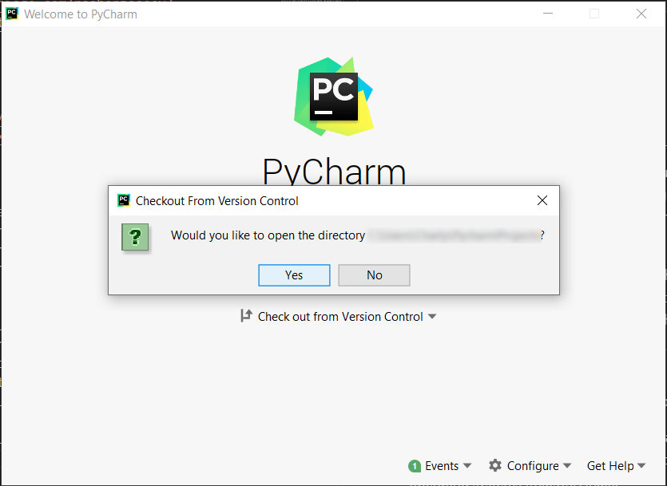

## Create branch

In Jetbrains Pycharm we go to right at the bottom of the window and click in Git: master, It will open dialog and show the branches in local and remote repository.

We are going to click in + New Branch and create a new branch "add-yourname".

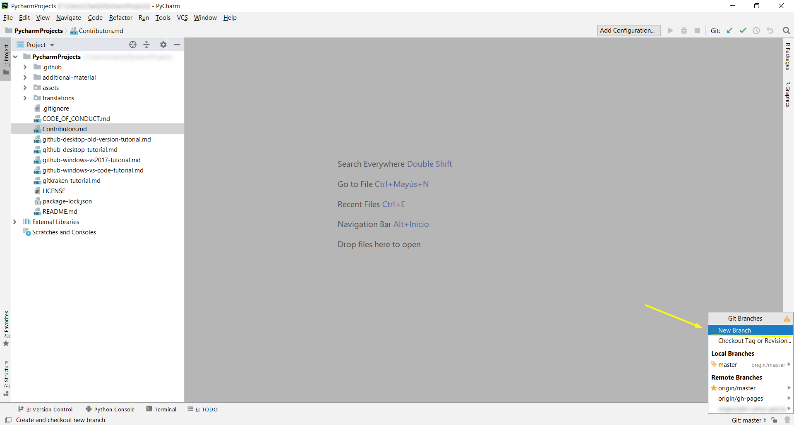

Give a name like "add-yourname" and click OK.

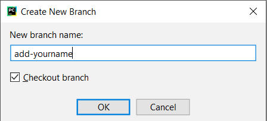

## Make necessary changes

When we create a new branch the dialog will display "Branch add-yourname", JetBrains PyCharm will show the active branch at the bottom right.

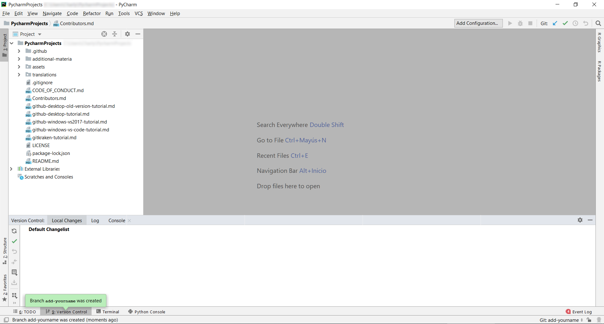

On the Project Explorer open Contributors.md file and make neccesary changes to add your name and github username in the following way.

``` - [Your Name](https://github.com/username) ```

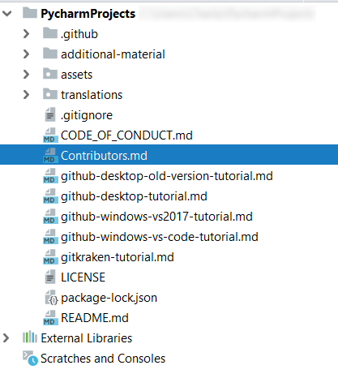

After putting your name and username we go to right at the bottom and do the following 

1. Click on 9. Version Control, it will display a banner and will show modified file.
2. Click on Commit.

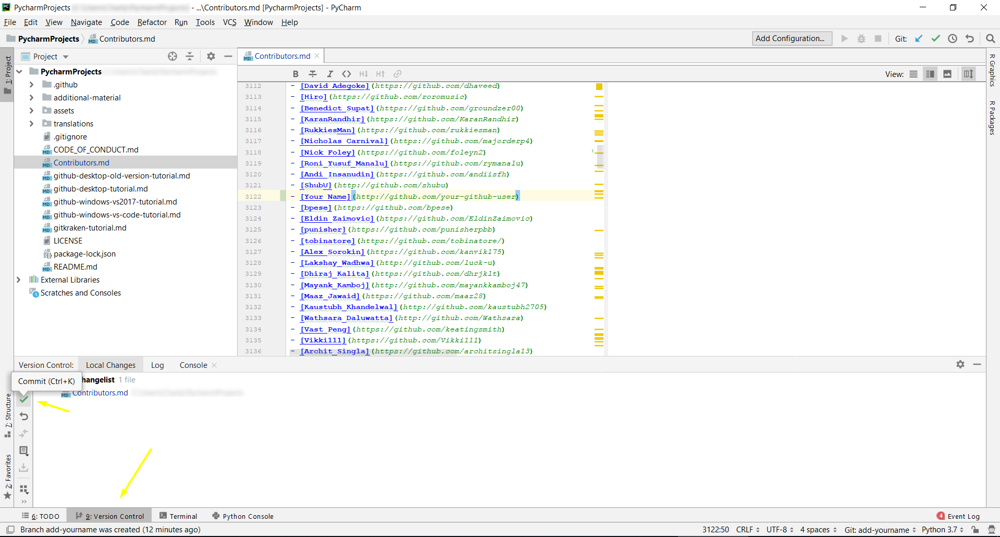

## Commiting changes and push in remote

Write the message "Add your name to Contributors List" and click in Commit.

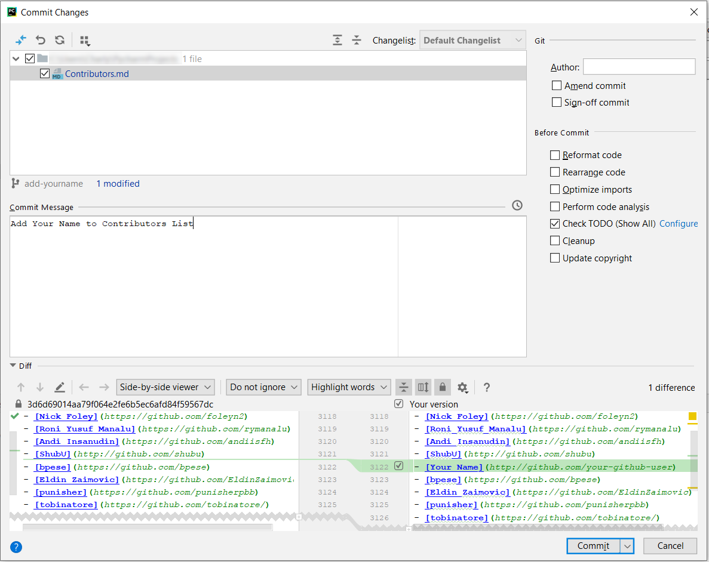

If committing message was OK you'll see a success message.

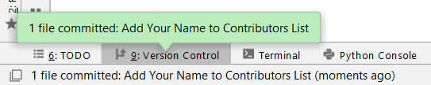

Now it's time to push your changes in remote branch (your forked repo), go to VCS -> Git -> Push

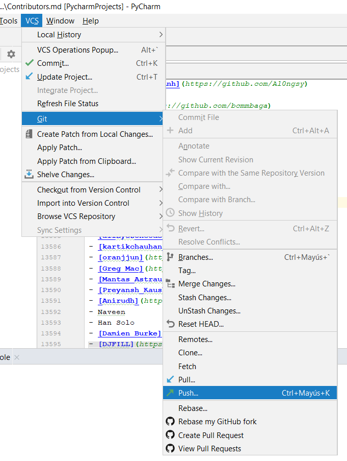

You'll see your local branch and remote branch, click in Push.

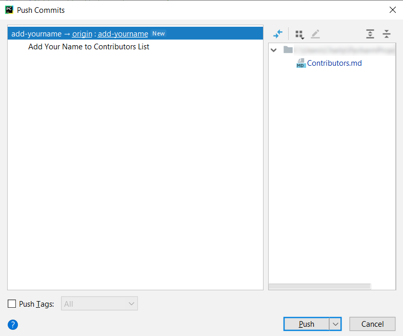

You'll see a success message if push in remote was OK, now it´s going to go to your repo and see the changes.

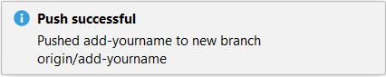

## Submit your changes for review

At this point you have completed your change but it still only resides in your repo.  This step will show you how to submit a request to the administrator of the top-level repo to merge your change.

In your repo on GitHub you'll see the `Compare & pull request` button next to the new branch notification. Click on that button.


Now submit the pull request.


Soon I'll be merging all your changes into the master branch of this project. You will get a notification email once the changes have been merged.

## Where to go from here?

Congrats!  You have just completed the standard _fork -> clone -> edit -> PR_ workflow that you'll encounter often as a contributor!

Celebrate your contribution and share it with your friends and followers by going to [web app](https://roshanjossey.github.io/first-contributions/#social-share).

You can join our slack team in case you need any help or have any questions. [Join slack team](https://join.slack.com/t/firstcontributors/shared_invite/enQtMzE1MTYwNzI3ODQ0LTZiMDA2OGI2NTYyNjM1MTFiNTc4YTRhZTg4OWZjMzA0ZWZmY2UxYzVkMzI1ZmVmOWI4ODdkZWQwNTM2NDVmNjY).

Now let's get you started with contributing to other projects. We've compiled a list of projects with easy issues you can get started on. Check out [the list of projects in web app](https://roshanjossey.github.io/first-contributions/#project-list).

### [Additional material](additional-material/git_workflow_scenarios/additional-material.md)


## Tutorials Using Other Tools

|<a href="README.md"></a>|<a href="github-desktop-tutorial.md"></a>|<a href="github-windows-vs2017-tutorial.md"></a>|<a href="gitkraken-tutorial.md"></a>|
|---|---|---|---|
|[Command Line](README.md)|[GitHub Desktop](github-desktop-tutorial.md)|[Visual Studio 2017](github-windows-vs2017-tutorial.md)|[GitKraken](gitkraken-tutorial.md)|


## Self-Promotion

If you liked this project, star it on [GitHub](https://github.com/Roshanjossey/first-contributions).
If you're feeling especially charitable, follow [Roshan](https://roshanjossey.github.io/) on
[Twitter](https://twitter.com/sudo__bangbang) and
[GitHub](https://github.com/roshanjossey).

<a href="http://saasgrids.com"> </a>

