

# First Contributions

|  | Visual Studio Code |
| ------------------------------------------------------------------------------------------------------------------------------------ | ------------------ |

It's hard. It's always hard the first time you do something. Especially when you are collaborating, making mistakes isn't a comfortable thing. But open source is all about collaboration & working together. We wanted to simplify the way new open-source contributors learn & contribute for the first time.

Reading articles & watching tutorials can help, but what comes better than actually doing the stuff without messing up anything. This project aims at providing guidance & simplifying the way rookies make their first contribution. Remember the more relaxed you are, the better you learn. If you are looking for making your first contribution, just follow the simple steps below. We promise you, it will be fun.

If you don't have Visual Studio Code on your machine, [install it](https://code.visualstudio.com/download).

**Notice:** This tutorial was made using Visual Studio Code (Version 1.27.2) on a Windows 10 machine. Later in this tutorial we will make use of some keyboard shortcuts. These may differ on other operating systems (macOS/Linux).

## Fork this repository

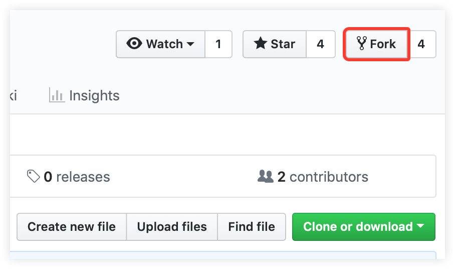

Fork this repo by clicking on the fork button on the top right of this page. This will create of copy of this repository in your GitHub account.

GitHub keeps track of the relationship between your repo and the one you have forked it from. You can think of your repo as a working copy.

Most top-level GitHub repos (i.e. ones not forked from any other repo) have a small core team of people who can directly commit changes. All other contributors must fork the repo and make changes in the fork, then create a Pull Request to ask for their changes to be merged back into the top-level repo. If the top-level repo administrator likes the changes they will be merged and you will gain instant fame and fortune! More on how to do that later.

## Clone your repository

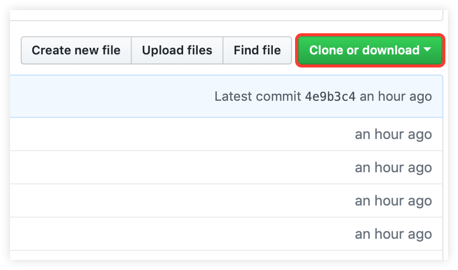

The next step is to clone your repo down to your machine so you can begin making changes. VS Code needs the URL of your repo, so click the "clone" button and then click the "copy to clipboard" icon.

**CAREFUL:** One mistake that new contributors often make is to clone the repo you forked _from_ rather than cloning your repo. Check your browser's address bar and make sure you are cloning your repo.

Now open up Visual Studio Code. The welcome page of VS Code will pop up. From there press `F1` to open up the bar shown below. Notice that there is already a `>` (greater than) sign in the text field. You can also get to the input prompt by pressing `CTRL-P` and then type the `>` character.

You may notice that there are already some obscure commands listed below. Those are my recently used commands. So just don't care about them.

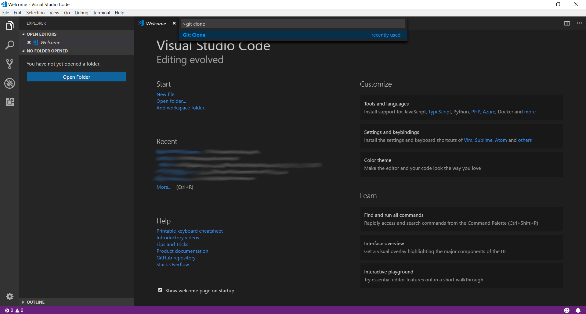

Now type in `git clone`, only `git` or `clone` (it works like a search).
Select the Entry `Git: Clone` and press `Enter`

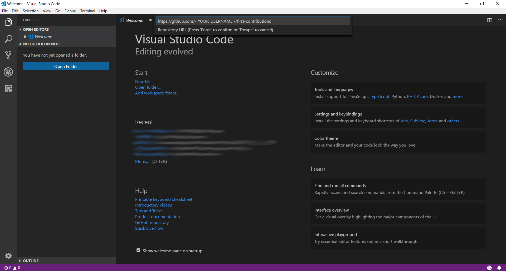

Paste the URL of your repository and press `Enter`. This will open up a File Explorer where you can then choose where the Git repository should be stored.

**Important**: Make sure it is the forked repository and not the original one, otherwise it won't work.

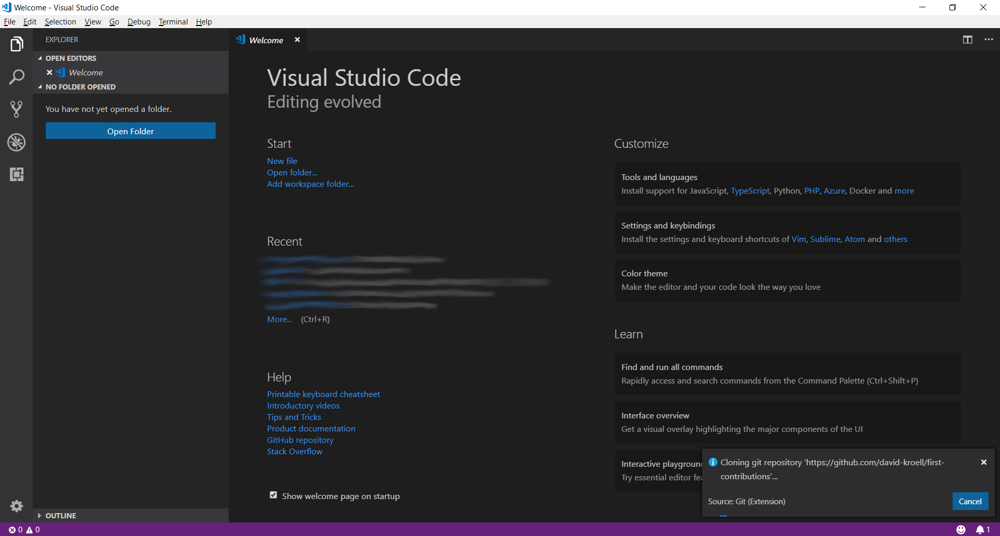

You should see a status popup on the bottom right of Visual Studio Code. After it has finished, you can open up the cloned repository (now a folder on your machine) using the buttons in the dialog.

## Create a branch

Open up the command palette again by pressing `F1`. Type in `branch` and select the `create branch` command from there. In the next step type in the name of your new branch, for example `add-david-kroell`. Press enter and the branch will be created. The branch is also already checked out. [What does checkout mean?](https://www.git-scm.com/docs/git-checkout)

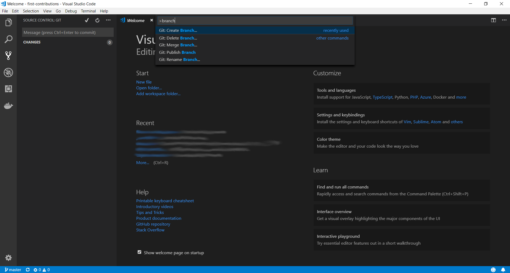

## Make necessary changes

Open `Contributors.md` and add your name anywhere in the file. This file contains GFM (GitHub Flavored Markdown) which is a proprietary flavor of the <a href="https://en.wikipedia.org/wiki/Markdown">markdown</a> syntax.

Copy one of the other contributors&apos; lines and modify it with your name to make sure you get the syntax right - it can be picky.

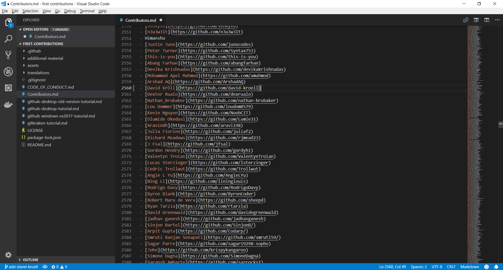

## Commit & Push changes to GitHub

On the left side of VS Code is a menu with 5 icons displayed. Select the version control/Source Control icon.
(Shortcut : Ctrl + Shift + G)

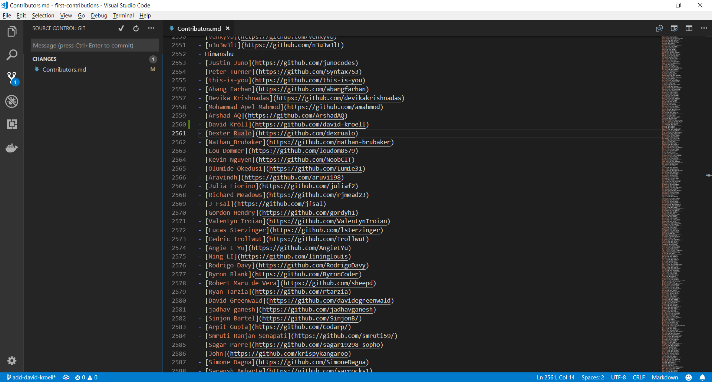

The file explorer displays all files which were changed after the last commit. By hovering the files and clicking the `+` (plus) the files are staged.

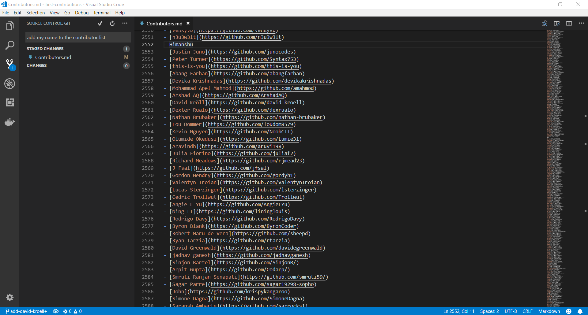

Type something in the line on top of the explorer and press the checkmark. The changes are now committed to your local copy. Now the changes have to be pushed back to GitHub.

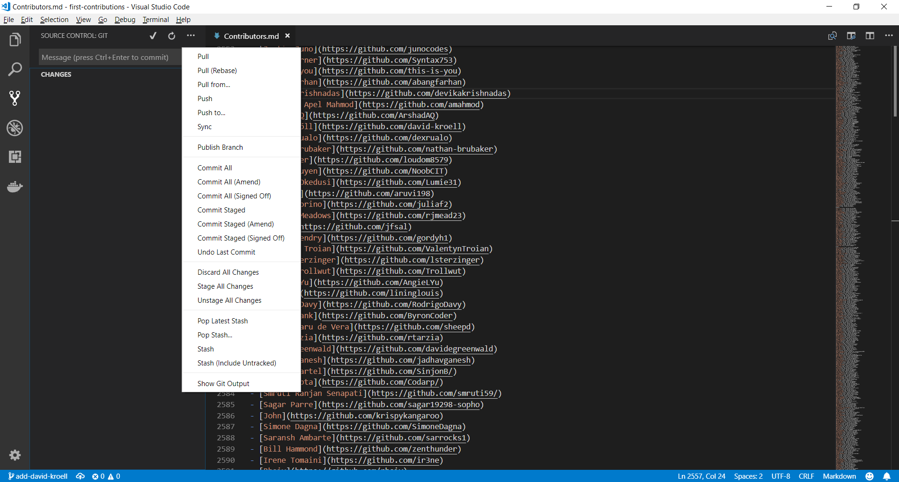

Use the three-dot icon to open up the menu where you select the `Publish Branch` option. This should open up a dialog to put your GitHub credentials in.

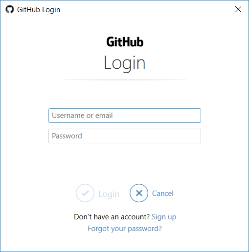

## Submit your changes for review

At this point you have completed your change but it still only resides in your repo. This step will show you how to submit a request to the administrator of the top-level repo to merge your change.

In your repo on GitHub you'll see the `Compare & pull request` button next to the new branch notification. Click on that button.

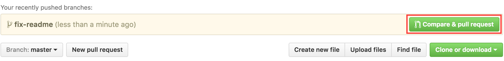

Now submit the pull request.

Soon I'll be merging all your changes into the master branch of this project. You will get a notification email once the changes have been merged.

## Where to go from here?

Congrats! You have just completed the standard _fork -> clone -> edit -> PR_ workflow that you'll encounter often as a contributor!

Celebrate your contribution and share it with your friends and followers by going to [web app](https://roshanjossey.github.io/first-contributions/#social-share).

You can join our slack team in case you need any help or have any questions. [Join slack team](https://join.slack.com/t/firstcontributors/shared_invite/enQtMzE1MTYwNzI3ODQ0LTZiMDA2OGI2NTYyNjM1MTFiNTc4YTRhZTg4OWZjMzA0ZWZmY2UxYzVkMzI1ZmVmOWI4ODdkZWQwNTM2NDVmNjY).

Now let's get you started with contributing to other projects. We've compiled a list of projects with easy issues you can get started on. Check out [the list of projects in web app](https://roshanjossey.github.io/first-contributions/#project-list).

### [Additional material](additional-material/git_workflow_scenarios/additional-material.md)

## Tutorials Using Other Tools

||||||
|---|---|---|---|---|
|[Command Line](README.md)|[GitHub Desktop](github-desktop-tutorial.md)|[Visual Studio 2017](github-windows-vs2017-tutorial.md)|[GitKraken](gitkraken-tutorial.md)|[Atlassian Sourcetree](sourcetree-macos-tutorial.md)|

## Self-Promotion

If you liked this project, star it on [GitHub](https://github.com/Roshanjossey/first-contributions).
If you're feeling especially charitable, follow [Roshan](https://roshanjossey.github.io/) on
[Twitter](https://twitter.com/sudo__bangbang) and
[GitHub](https://github.com/roshanjossey).

<a href="http://saasgrids.com"> 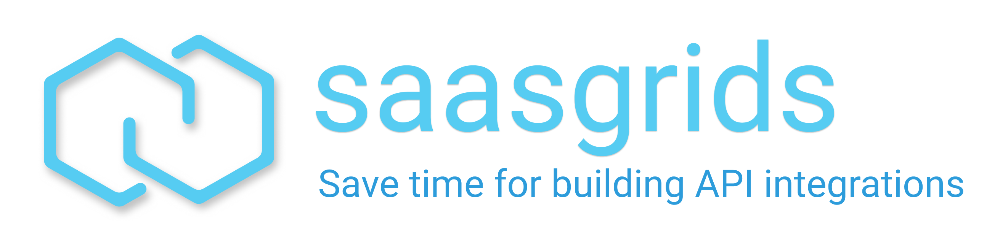</a>
