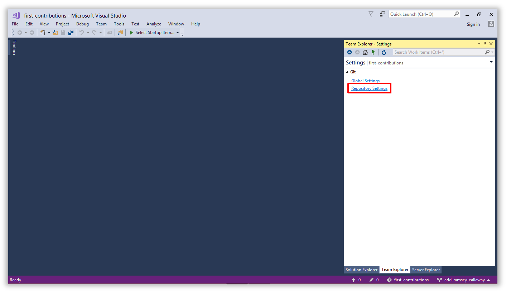
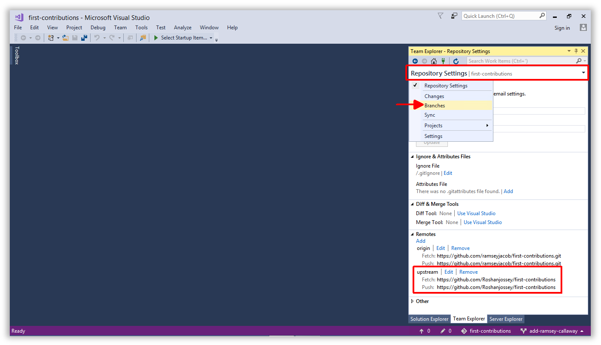
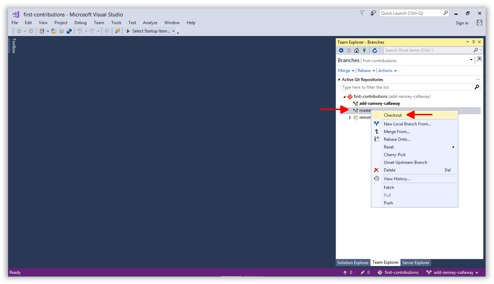
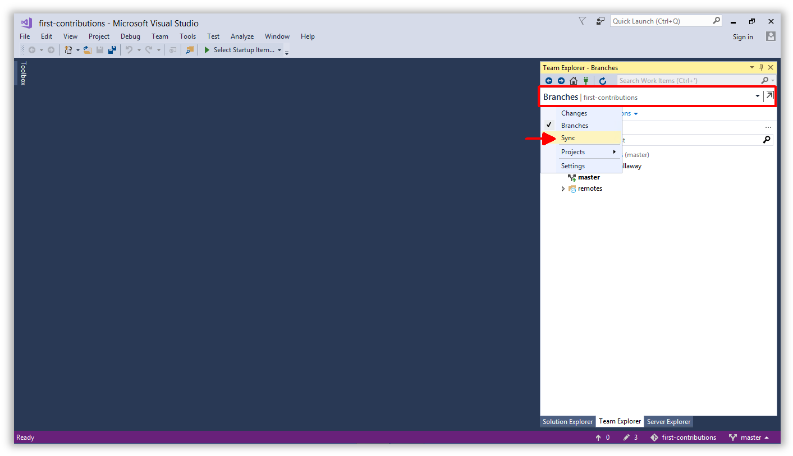
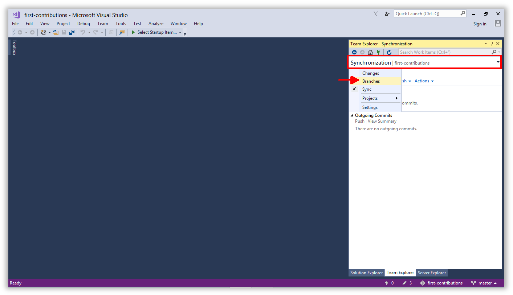
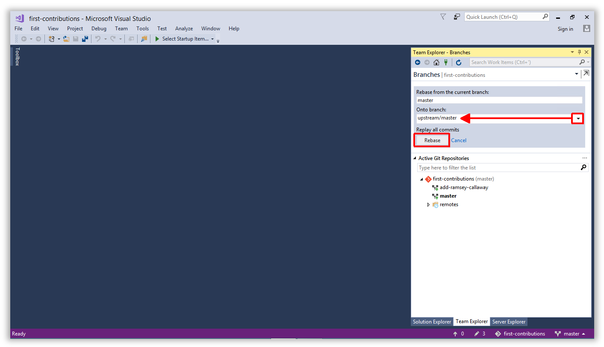
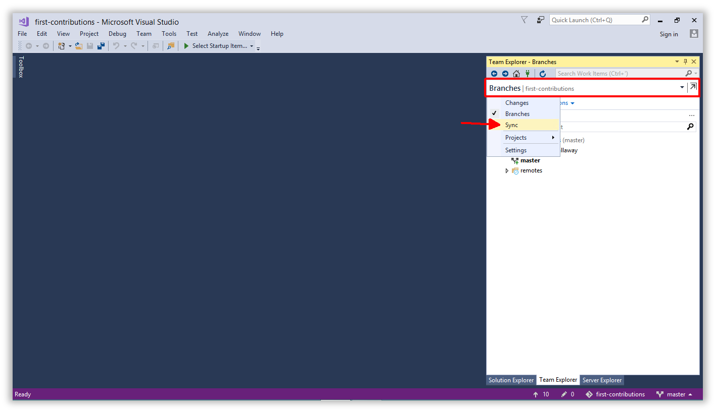
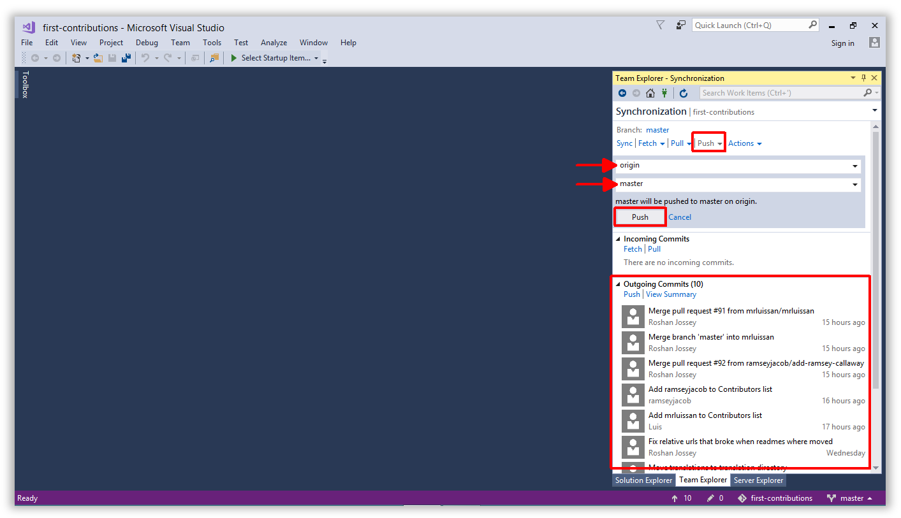

# First Contributions

||Visual Studio 2017 Edition|
|---|---|

It's hard. It's always hard the first time you do something. Especially when you are collaborating, making mistakes isn't a comfortable thing. But open source is all about collaboration & working together. We wanted to simplify the way new open-source contributors learn & contribute for the first time.

Reading articles & watching tutorials can help, but what comes better than actually doing the stuff without messing up anything. This project aims at providing guidance & simplifying the way rookies make their first contribution. Remember the more relaxed you are the better you learn. If you are looking for making your first contribution just follow the simple steps below. We promise you, it will be fun.

If you don't have Visual Studio 2017 on your machine, [install it](https://www.visualstudio.com/downloads/).

## Fork this repository

Fork this repo by clicking on the fork button on the top of this page. This will create of copy of this repository in your GitHub account.

GitHub keeps track of the relationship between your repo and the one you forked it from.  You can think of your repo as a working copy.

Most top-level GitHub repos (i.e. ones not forked from any other repo) have a small core team of people who can directly commit changes.  All other contributors must fork the repo and make changes in the fork, then create a Pull Request 
to ask for their changes to be merged back into the top-level repo. If the top-level repo administrator likes the changes they will be merged and you will gain instant fame and fortune!  More on how to do that later.

## Clone your repository

The next step is to clone your repo down to your machine so you can begin making changes. Visual Studio needs the URL of your repo, so click the clone button and then 
click the copy to clipboard icon.

**CAREFUL:** One mistake new contributors often make is to clone the repo you forked *from* rather than cloning your repo.  Check your browser's address bar and make sure you are cloning your repo.

It is now time to jump in to Visual Studio 2017!  You will be working in the Team Explorer tab for most of this tutorial.  If it is not open by default, click `View > Team Explorer` to open it.

Team Explorer has many views and there are navigation buttons located at the top to help you find the different areas.  To clone a repo, you need to be on the Connect view, which should be the
default.  If you do not see the clone button, click the green plug at the top.

Click the `Clone` option under **Local Git Repositories** and paste the URL to your repo in the text box.  This should be the URL you copied to your clipboard from GitHub previously.

Click the `Clone` button to initiate the process.

When the process is complete you will be moved over to the Solution Explorer tab where you can see the contents of your repo.  Yours will look different than the screenshot below because things change!

## Create a branch

Click back to the Team Explorer tab and use the main navigation dropdown to open the Branches view.

You should see the **first-contributions** repo and the default branch, which is called `master`.  Right-click on `master` and choose `New Local Branch From...`.

Give your branch a name like `add-<your_name_here>`, for example: `add-alonzo-church`.

Leave the `Checkout branch` box checked and click the `Create Branch` button.

You should see your new branch in the list.

## Make necessary changes

Open `Contributors.md` and add your name to the end of the list. This file contains GFM (GitHub Flavored Markdown) which is a proprietary flavor of the <a href="https://en.wikipedia.org/wiki/Markdown">markdown</a> syntax.

Copy one of the other contributors&apos; lines and modify it with your name to make sure you get the syntax right - it can be picky.

## Commit & Push changes to GitHub

Switch back to Team Explorer and navigate to the Changes view.

Enter the information you want posted with your commits and click `Save`. Visual Studio will remember it for future commits.

**NOTE:** Visual Studio uses a hidden folder called `.vs` to store your personal settings and preferences.  The contents of this folder **should not be saved in Git**.
If it has not been ignored already, you may need to tell Git to ignore this folder so it does not send it up to the repo.

This folder has already been ignored in this repo, so you should not have to perform this step...it is just here for your reference on future projects.

Now you should see a list of changed files and a textbox to type a commit comment.  Comments should be brief but thorough.  There is nothing worse than reading through commit comments and
seeing this: `"I updated some stuff"`. Take a few seconds to outline your commit.  Your team will thank you later, and you might even thank yourself!

Click `Commit All and Push` to perform a local commit and push your changes back up to your repo, all in one step.

**NOTE:** Commit can be performed separately from Push.  We do both here for convenience. Commit logs your changes locally but they will not be reflected in your GitHub repo until you Push.

The first time you Push to GitHub, Visual Studio will ask for your GitHub credentials.  They will be cached so you should not see this very often.

After the Push operation completes, open your repo in GitHub and you should see a message indicating a recently pushed branch.

You can view your changes by opening the `Branch: master` dropdown and selecting your new branch. Congratulations, you can share the branch URL with the world to show your progress!

## Submit your changes for review

At this point you have completed your change but it still only resides in your repo.  This step will show you how to submit a request to the administrator of the top-level repo to merge your
change.

In your repo on GitHub you'll see the `Compare & pull request` button next to the new branch notification. Click that button.

Now submit the pull request.

## Keeping your fork synced with this repository

Over time the top-level repo will continue to change.  For example, every time someone completes this tutorial the result is a merged commit to the top-level repo's `master` branch.
It is great when that happens, but now your `master` is out of sync.  This whole time you've been making changes in your `add-alonzo-church` branch.

This section will show you how to make your `master` branch match the `master` branch of the top-level repo you forked from.  The top-level repo can also be referred to as the `upstream` repo.

GitHub does not automatically push new changes from the upstream repo down to all forks.  Instead, it is your job as the administrator of your fork to keep it in sync.  There is no way to push 
changes from the upstream repo to your fork directly - you must fetch the changes from the upstream repo down to your local machine and replay all the commits against the files locally.  That is 
called a `rebase` operation.

After you rebase onto your local `master` branch, you then push to your fork and now you are in sync!  Let's get started.

Open Team Explorer and click on the house icon to open the Home view, then click `Settings`.

Click **Repository Settings**.

At this point your local machine does not know about the upstream repo you forked from, it only knows about your fork.  In Git terminology, a connection to any remote repo is called a `remote`.
When you clone your repo, Git automatically creates a remote called `origin`.

You will now create a remote called `upstream` which points to the top-level repo.  The name `upstream` is just a convention - you could call it anything you like.

In Visual Studio click **Add** under the listing of `Remotes`.  You can see that `origin` already exists.

Name the remote `upstream` and paste the top-level URL from GitHub (e.g. `https://github.com/Roshanjossey/first-contributions`) into the dialog box.

You should see the remote added to the list.

Next, use the main navigation dropdown to open the Branches view.

**IMPORTANT:** You must change your active branch to `master` since that's the branch you want to synchronize.  Changing the active branch is called `checkout`.

Right-click on `master` and choose `Checkout` to change your active branch.  You can see your active branch in the bottom right corner of the Visual Studio window.

After the checkout process completes, use the main navigation dropdown to open the Sync view.

The Sync view should have `Branch: master` at the top if your checkout worked.  Now it is time to fetch the latest changes from the upstream repo down to your local machine.

Click **Fetch** and choose the `upstream` remote from the list.

Click the `Fetch` button.

Next, use the main navigation dropdown to open the Branches view again.

Click **Rebase** and choose `upstream/master` in the **Onto branch:** list.

Click the `Rebase` button.

All of the changes from the upstream repo have been replayed onto your local master branch.  Now it is time to push these changes up to your repo (a.k.a the `origin` remote).

Use the main navigation dropdown to open the Sync view.

Click **Push** and choose `origin` / `master` in the lists.  If there are changes you can see them in the `Outgoing Commits` list at the bottom of the Sync view.

Click the `Push` button.

Way to go, you are in sync!

## Tutorials Using Other Tools

||||
|---|---|---|
|[Command Line](README.md)|[GitHub Desktop](github-desktop-tutorial.md)|[GitKraken](gitkraken-tutorial.md)|

## Where to go from here?

You could also join our slack team in case you need any help or have any questions. [Join slack team](https://firstcontributions.herokuapp.com)

Here's some beginner level issues in popular repos that you can solve. Go ahead and go to those repos to learn more

|||||||||
|---|---|---|---|---|---|---|---|
|[exercism](https://github.com/exercism/exercism.io/issues?q=is%3Aopen+is%3Aissue+label%3A%22good+first+patch%22)|[Fun Retros](https://github.com/funretro/distributed/issues?q=is%3Aopen+is%3Aissue+label%3Abeginner-friendly)|[react](https://github.com/facebook/react/issues?q=is%3Aopen+is%3Aissue+label%3A%22good+first+bug%22)|[habitat](https://github.com/habitat-sh/habitat/issues?q=is%3Aopen+is%3Aissue+label%3AEasy)|[scikit-learn](https://github.com/scikit-learn/scikit-learn/issues?q=is%3Aopen+is%3Aissue+label%3AEasy)|[Leiningen](https://github.com/technomancy/leiningen/issues?q=is%3Aopen+is%3Aissue+label%3ANewbie)|[numpy](https://github.com/numpy/numpy/issues?q=is%3Aopen+is%3Aissue+label%3A%22Easy+Fix%22)|[elasticsearch](https://github.com/elastic/elasticsearch/issues?q=is%3Aopen+is%3Aissue+label%3A%22low+hanging+fruit%22)|
|||||||||
|[homebrew](https://github.com/Homebrew/brew/issues?q=is%3Aopen+is%3Aissue+label%3A%22help+wanted%22)|[Rust](https://github.com/rust-lang/rust/issues?q=is%3Aopen+is%3Aissue+label%3AE-easy)|[vuejs](https://github.com/vuejs/vue/issues?q=is%3Aopen+is%3Aissue+label%3A%22contribution+welcome%22)|[Suave](https://github.com/SuaveIO/suave/issues?q=is%3Aopen+is%3Aissue+label%3Ahardness-easy)|[OpenRA](https://github.com/OpenRA/OpenRA/issues?q=is%3Aopen+is%3Aissue+label%3AEasy)|[PowerShell](https://github.com/powershell/powershell/issues?q=is%3Aopen+is%3Aissue+label%3AUp-for-Grabs)|[coala](https://github.com/coala/coala/issues?q=is%3Aopen+is%3Aissue+label%3Adifficulty%2Flow+label%3Adifficulty%2Fnewcomer)|[moment](https://github.com/moment/moment/issues?q=is%3Aopen+is%3Aissue+label%3AUp-For-Grabs)|
||||||| ||
|[ava](https://github.com/avajs/ava/issues?q=is%3Aopen+is%3Aissue+label%3A%22good+for+beginner%22)|[freeCodeCamp](https://github.com/freeCodeCamp/freeCodeCamp/issues?q=is%3Aopen+is%3Aissue+label%3Afirst-timers-only)|[webpack](https://github.com/webpack/webpack/issues?q=is%3Aopen+is%3Aissue+label%3A%22D1%3A+Easy+%28Contrib.+Difficulty%29%22)|[hoodie](https://github.com/hoodiehq/hoodie/issues?q=is%3Aopen+is%3Aissue+label%3Afirst-timers-only)|[pouchdb](https://github.com/pouchdb/pouchdb/issues?q=is%3Aopen+is%3Aissue+label%3A%22first+timers+only%22)|[neovim](https://github.com/neovim/neovim/issues?q=is%3Aopen+is%3Aissue+label%3Aentry-level)|[babel](https://github.com/babel/babel/issues?q=is%3Aopen+is%3Aissue+label%3Abeginner-friendly) |[brackets](https://github.com/adobe/brackets/labels/Starter%20bug)|
| ||
| [Node.js](https://github.com/nodejs/node/issues?q=is%3Aissue+is%3Aopen+label%3A%22good+first+contribution%22) |[Semantic-UI-React](https://github.com/Semantic-Org/Semantic-UI-React/issues?q=is%3Aissue+is%3Aopen+label%3A%22good+first+contribution%22) |
