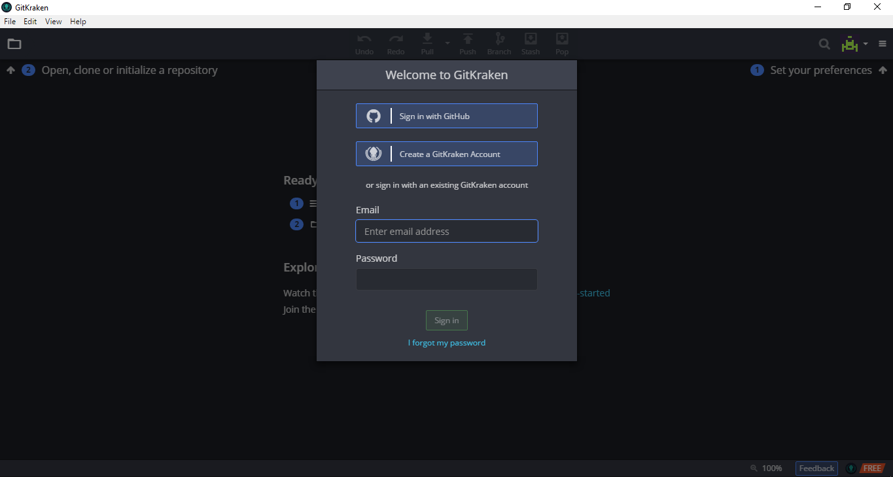
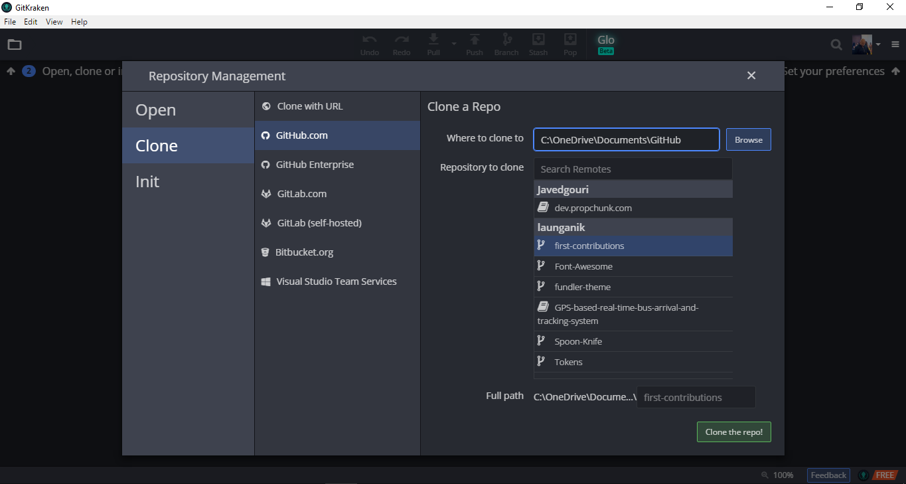
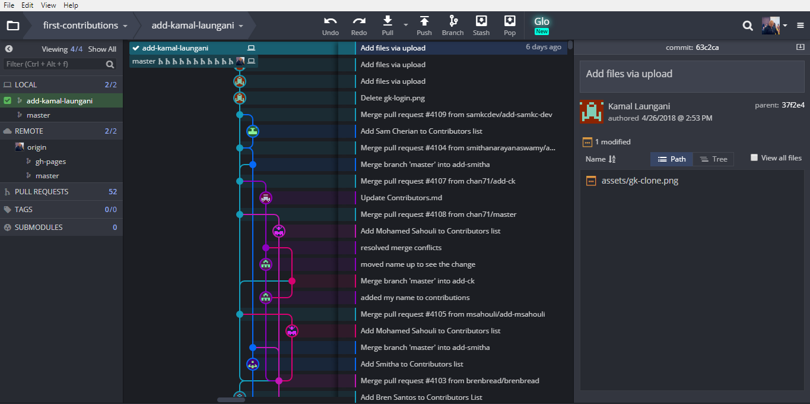
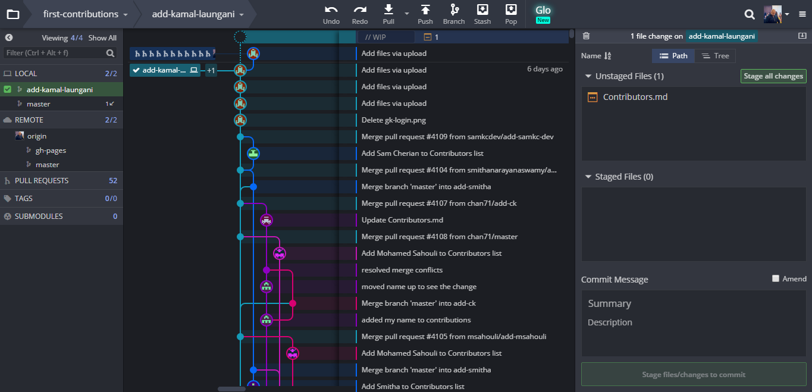
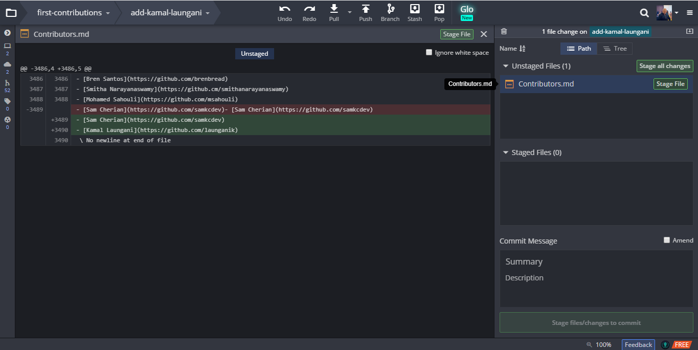
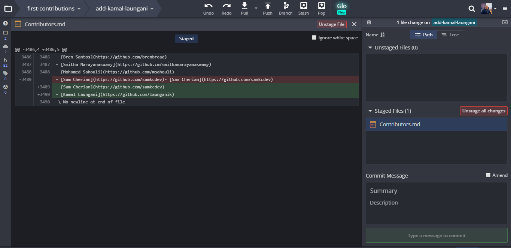
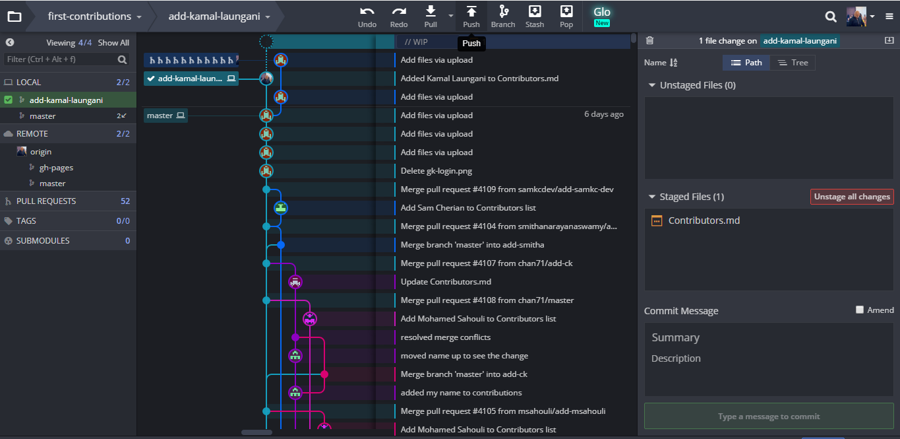
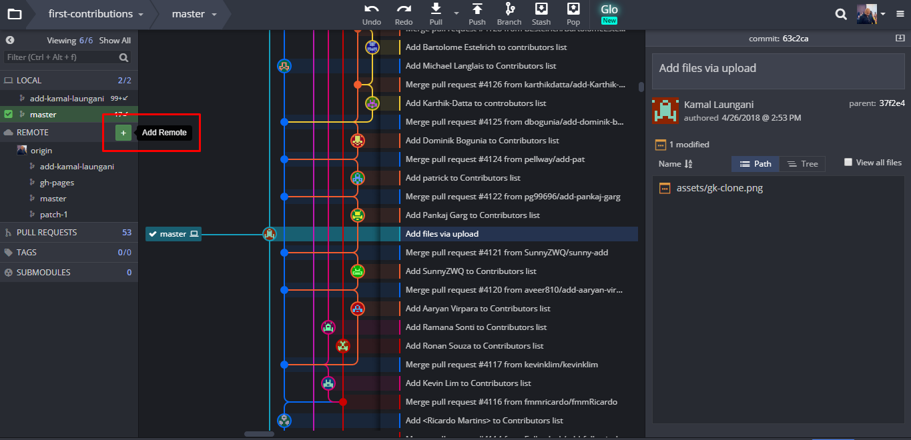
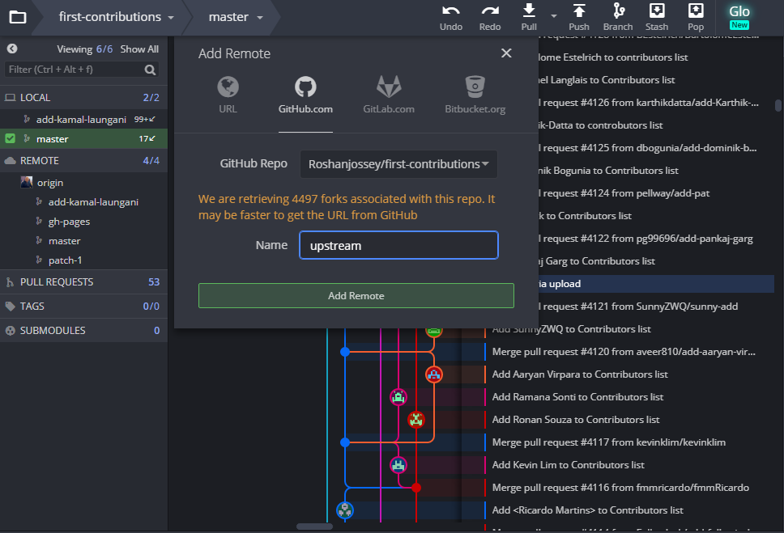
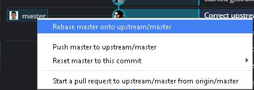

# First Contributions

||GitKraken Edition|
|---|---|

It's hard. It's always hard the first time you do something. Especially when you are collaborating, making mistakes isn't a comfortable thing. But open source is all about collaboration & working together. We wanted to simplify the way new open-source contributors learn & contribute for the first time.

Reading articles & watching tutorials can help, but what comes better than actually doing the stuff without messing up anything. This project aims at providing guidance & simplifying the way rookies make their first contribution. Remember the more relaxed you are the better you learn. If you are looking for making your first contribution just follow the simple steps below. We promise you, it will be fun.

## Git Kraken

Download [GitKraken](https://www.gitkraken.com), install and open it.

You should see the "Welcome to GitKraken" modal dialog - Sign in with GitHub and allow GitKraken access to your GitHub account.

(optional) Go to File->Preferences and set your project directory to the root of your local repositories.

## Fork this repository

Fork this repo by clicking on the fork button on the top of this page.

This will create of copy of this repository in your account.

## Clone the repository

In GitKraken, go to File->Clone Repo.

Select GitHub.com in the right pane.  Under your username, you should see first-contributions.  Click that repository and check the full path shown at the bottom of this pane.  

Once you're satisfied with the path, click "Clone the repo!".

## Create a branch

Click the branch button on the toolbar.

Name your branch add-your-name, for example: "add-william-sutton"

## Make necessary changes and commit those changes

Now open `Contributors.md` file in a text editor and add your name to it, then save the file. 

If you have the repo open in GitKraken you'll see there are changes. Review and stage those changes by selecting the newest commit marked with "// WIP" and the number of files changed and the type of change.

Review the files that have been changed and decide what you would like to stage.  Staging is important to tell git exactly what file changes you want associated with this commit.

Once you have a good commit message ("Add <your-name> to Contributors list" sounds nice and descriptive) and are happy with your changes, you can hit "Stage all changes" to stage everything that's modified or "Stage File" to stage an individual file.

If you change your mind, you can unstage those changes, or you can discard them all together.  WARNING: As the word discard implies, this is a destructive operation.  Only do this if you don't want any change from whatever repository you're in.

Hit commit.

Congratulations, you've commited changes to your local copy of your branch of your fork of first-contributions.  Onward!

## Push changes to GitHub

Click the Push button on the toolbar.

## Submit your changes for review

If you go to your repository on github, you'll see  `Compare & pull request` button. click on that button.

Now submit the pull request.

Now I'll be merging all your changes into the master branch of this project. You will get a notification email once the changes have been merged.

Master branch of your fork won't have those changes. In order to keep your fork synced with mine, follow the steps below.

## Keeping your fork synced with this repository

 First, switch to master branch.
 

 Double click on master on the left under origin.
 

 Then, add my repo's url as `upstream remote url`.
 
 
 

 Click on the '+' that reveals itself after you hover Remote on the left.
 
 
 
 

 Select Roshanjossey/first-contributions and name the remote upstream.
 
 Click Add Remote.

 
 This is a way of telling git that another version of this project exists in the specified url and we're calling it upstream. Once the changes are merged, fetch the new version of my repository.

 
 Double click the master branch under upstream on the left.

 

 

 
 
Here we're fetching all the changes in my fork (upstream remote). Now, you need to merge the new revision of my repository into your master branch.

Drag your master branch (marked by your profile picture) on top of the upstream's master.

Here you're applying all the changes you fetched to master branch. If you push master branch now, your fork will also have the changes

Click push again, and this time make sure to select origin/master at the top

Notice here you're pushing to the remote named origin.

## Tutorials Using Other Tools

||||
|---|---|---|
|[Command Line](README.md)|[Visual Studio 2017](github-windows-vs2017-tutorial.md)|[GitHub Desktop](github-desktop-tutorial.md)|

## Where to go from here?

Here's some beginner level issues in popular repos that you can solve. Go ahead and go to those repos to learn more

|||||||||
|---|---|---|---|---|---|---|---|
|[exercism](https://github.com/exercism/exercism.io/issues?q=is%3Aopen+is%3Aissue+label%3A%22good+first+patch%22)|[Fun Retros](https://github.com/funretro/distributed/issues?q=is%3Aopen+is%3Aissue+label%3Abeginner-friendly)|[react](https://github.com/facebook/react/issues?q=is%3Aopen+is%3Aissue+label%3A%22good+first+bug%22)|[habitat](https://github.com/habitat-sh/habitat/issues?q=is%3Aopen+is%3Aissue+label%3AEasy)|[scikit-learn](https://github.com/scikit-learn/scikit-learn/issues?q=is%3Aopen+is%3Aissue+label%3AEasy)|[Leiningen](https://github.com/technomancy/leiningen/issues?q=is%3Aopen+is%3Aissue+label%3ANewbie)|[numpy](https://github.com/numpy/numpy/issues?q=is%3Aopen+is%3Aissue+label%3A%22Easy+Fix%22)|[elasticsearch](https://github.com/elastic/elasticsearch/issues?q=is%3Aopen+is%3Aissue+label%3A%22low+hanging+fruit%22)|
|||||||||
|[homebrew](https://github.com/Homebrew/brew/issues?q=is%3Aopen+is%3Aissue+label%3A%22help+wanted%22)|[Rust](https://github.com/rust-lang/rust/issues?q=is%3Aopen+is%3Aissue+label%3AE-easy)|[vuejs](https://github.com/vuejs/vue/issues?q=is%3Aopen+is%3Aissue+label%3A%22contribution+welcome%22)|[Suave](https://github.com/SuaveIO/suave/issues?q=is%3Aopen+is%3Aissue+label%3Ahardness-easy)|[OpenRA](https://github.com/OpenRA/OpenRA/issues?q=is%3Aopen+is%3Aissue+label%3AEasy)|[PowerShell](https://github.com/powershell/powershell/issues?q=is%3Aopen+is%3Aissue+label%3AUp-for-Grabs)|[coala](https://github.com/coala/coala/issues?q=is%3Aopen+is%3Aissue+label%3Adifficulty%2Flow+label%3Adifficulty%2Fnewcomer)|[moment](https://github.com/moment/moment/issues?q=is%3Aopen+is%3Aissue+label%3AUp-For-Grabs)|
||||||| ||
|[ava](https://github.com/avajs/ava/issues?q=is%3Aopen+is%3Aissue+label%3A%22good+for+beginner%22)|[freeCodeCamp](https://github.com/freeCodeCamp/freeCodeCamp/issues?q=is%3Aopen+is%3Aissue+label%3Afirst-timers-only)|[webpack](https://github.com/webpack/webpack/issues?q=is%3Aopen+is%3Aissue+label%3A%22D1%3A+Easy+%28Contrib.+Difficulty%29%22)|[hoodie](https://github.com/hoodiehq/hoodie/issues?q=is%3Aopen+is%3Aissue+label%3Afirst-timers-only)|[pouchdb](https://github.com/pouchdb/pouchdb/issues?q=is%3Aopen+is%3Aissue+label%3A%22first+timers+only%22)|[neovim](https://github.com/neovim/neovim/issues?q=is%3Aopen+is%3Aissue+label%3Aentry-level)|[babel](https://github.com/babel/babel/issues?q=is%3Aopen+is%3Aissue+label%3Abeginner-friendly) |[brackets](https://github.com/adobe/brackets/labels/Starter%20bug)|
| ||
| [Node.js](https://github.com/nodejs/node/issues?q=is%3Aissue+is%3Aopen+label%3A%22good+first+contribution%22) |[Semantic-UI-React](https://github.com/Semantic-Org/Semantic-UI-React/issues?q=is%3Aissue+is%3Aopen+label%3A%22good+first+contribution%22) |
