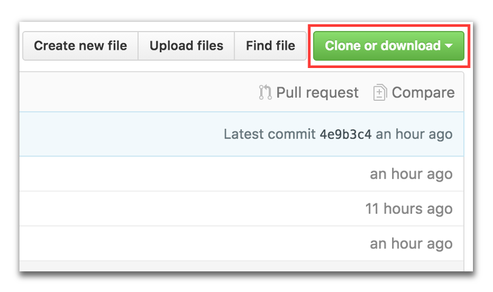
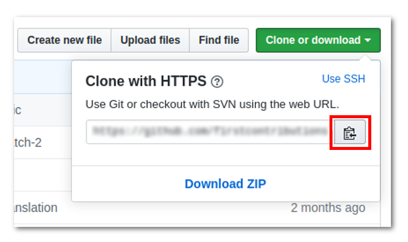

[](https://github.com/ellerbrock/open-source-badges/)
[](https://join.slack.com/t/firstcontributors/shared_invite/enQtNjkxNzQwNzA2MTMwLTVhMWJjNjg2ODRlNWZhNjIzYjgwNDIyZWYwZjhjYTQ4OTBjMWM0MmFhZDUxNzBiYzczMGNiYzcxNjkzZDZlMDM)
[](https://opensource.org/licenses/MIT)
[](https://www.codetriage.com/roshanjossey/first-contributions)


# Premières Contributions

C'est toujours compliqué la première fois que l'on fait quelque chose. La peur de faire des fautes n'est pas légère, particulièrement quand on travaille en collaboration. Donc, nous voulons simplifier ce monde pour des nouveaux contributeurs au logiciel libre en vous enseignant à contribuer pour la première fois.  

Lisant des articles et des tutoriels peut aider, mais n'est-il pas mieux de essayer les choses pratiquement et apprendre de nos erreurs ? C'est là que ce monde se différencie d'autrui. Et ce projet a le but de simplifier la manière dont les apprentis font leur première contribution. Si vous aspirez à faire votre première contribution, suivez tout simplement les étapes suivantes.

# Objectifs

Vous deviendrez collaborateur dans notre projet en ajoutant votre nom au fichier [Contributors.md](Contributors.md "Liste des Contributeurs")

Pour achèver cet objectifs nous allons:
1. Créer une copie de ce projet
2. Ajouter votre nom dans la copie
3. Combiner la copie avec le projet original

## Préparez-vous

Si vous préfèrez un outil graphique à la console, voyez [ces tutoriels.](#tutoriels-en-utilisant-des-outils-graphiques)\
Si vous êtes à l'aise avec la console, mais vous n'avez pas Git sur votre ordinateur, [ installez-le ]( https://help.github.com/articles/set-up-git/ ).


## Embranchez ce répertoire (aussi appelé un Fork)

Embranchez ce répertoire en cliquant sur le bouton de fork en haut de la page.
Cela va créer une copie du répertoire dans votre compte.


## Clonez votre Fork




Maintenant, vous allez faire ajouter votre nom sur ce répertoire copié., donc clonez ce Fork (le répertoire embranché)  sur votre ordinateur. Cliquez sur le bouton **Clone** puis cliquez sur l'icone *copier dans le presse-papier*.


Ouvrez une console et exécutez les commandes git suivantes :

```
git clone ­«l'url copié»
```
où [«l'url copié»](# "Pour coller dans la console :&NewLine;Linux - Ctrl + Shift + V&NewLine;Windows - Alt + Space &rarr; Edit &rarr; Paste&NewLine;MacOS - ⌘ V") (sans les guillemets) est l'url du répertoire . Voir la section précédente afin d'obtenir l'url.


Par exemple :
```
git clone https://github.com/votre-nom-d-utilisateur/first-contributions.git
```
où `votre-nom-d-utilisateur` est votre nom d'utilisateur GitHub. Ici vous êtes en train de copier le contenu du répertoire `first-contributions` sur votre ordinateur.

## Créez une branche

Déplacez-vous dans le répertoire du projet nouvellement cloné (si vous n'y êtes pas encore) :

```
cd first-contributions
```
Maintenant créez une branche avec le commande `git checkout` :
```
git checkout -b <add-votre-nom>
```

Par exemple :
```
git checkout -b add-koffi-sani
```
(Le nom de la branche n'a pas besoin de contenir le terme *add*, mais c'est raisonnable de l'inclure parce que l'objectif de cette branche est d'ajouter votre nom à une liste.)

## Effectuez les modifications nécessaires et engagez-les

Maintenant, ouvrez le fichier `Contributors.md` dans un éditeur de texte, ajoutez-y votre nom, et enregistrez-le.


Si vous ouvrez la console et vous exécutez la commande  `git status`, vous verrez qu'il y a des modifications. Ajoutez ces modifications à la branche que vous venez de créer avec la commande  `git add` :
```
git add Contributors.md
```

Maintenant engagez ces modifications avec la commande `git commit`:
```
git commit -m "Add <votre-nom> to Contributors list"
```
en remplaçant `<votre-nom>` par votre nom.

## Poussez les modifications vers GitHub

Poussez vos modifications avec la commande `git push` :
```
git push origin <add-votre-nom>
```
en remplaçant `<add-votre-nom>` avec le nom de la branche précédemment créée.

## Soumettez vos changements pour révision

Si vous visitez votre répertoire sur Github, vous verrez un bouton  `Compare & pull request`.  Cliquez sur ce bouton.


Maintenant soumettez la demande de tirage.


Bientôt, j'aurai fusionné toutes vos modifications avec la branche master de ce projet. Vous recevrez un mail de notification dès que la fusion sera effectuée.

## Temps de Célébrations !


Vous avez réussi à contribuer par la manière standarde de <center><b>Fork &rarr; Clone &rarr; Edit &rarr; PR</b></center>

\
Célébrez votre contribution et partagez-la avec vos amis en utilisant notre [app web.](https://firstcontributions.github.io/#social-share)


## Où aller ensuite ?

Maintent vous pouvez commencer à contribuer aux d'autres projets. Nous avons préparez une liste de projets avec des problèmes simples pour commencer. Le voici sur notre [app web](https://firstcontributions.github.io/#project-list)

Vous pouvez aussi rejoindre [notre équipe sur Slack](https://join.slack.com/t/firstcontributors/shared_invite/enQtMzE1MTYwNzI3ODQ0LTZiMDA2OGI2NTYyNjM1MTFiNTc4YTRhZTg4OWZjMzA0ZWZmY2UxYzVkMzI1ZmVmOWI4ODdkZWQwNTM2NDVmNjY) au cas où vous auriez besoin d'aide ou auriez des questions.


## Tutoriels en utilisant des outils graphiques


|<a href="github-desktop-tutorial.md"></a>|<a href="github-windows-vs2017-tutorial.md"></a>|<a href="gitkraken-tutorial.md"></a>|<a href="github-windows-vs-code-tutorial.md"></a>|<a href="sourcetree-macos-tutorial.md"></a>|<a href="github-windows-intellij-tutorial.md"></a>|
|---|---|---|---|---|---|
|[GitHub Desktop](github-desktop-tutorial.md)|[Visual Studio 2017](github-windows-vs2017-tutorial.md)|[GitKraken](gitkraken-tutorial.md)|[Visual Studio Code](github-windows-vs-code-tutorial.md)|[Atlassian Sourcetree](sourcetree-macos-tutorial.md)|[IntelliJ IDEA](github-windows-intellij-tutorial.md)|
