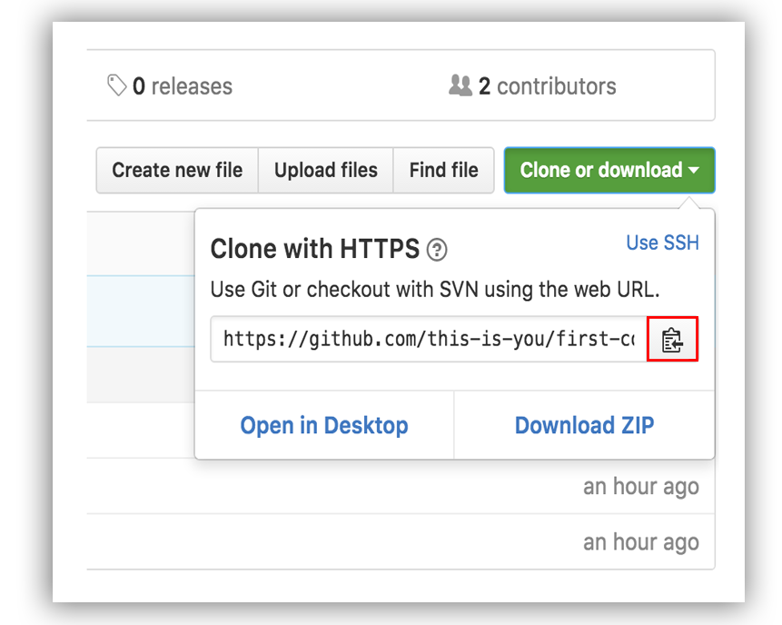
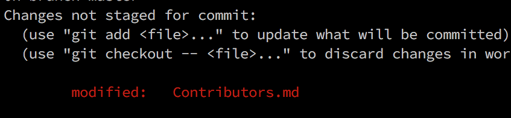
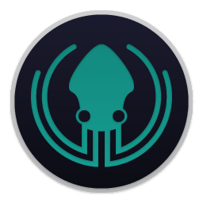

[](https://github.com/ellerbrock/open-source-badges/)
[](https://join.slack.com/t/firstcontributors/shared_invite/enQtNjkxNzQwNzA2MTMwLTVhMWJjNjg2ODRlNWZhNjIzYjgwNDIyZWYwZjhjYTQ4OTBjMWM0MmFhZDUxNzBiYzczMGNiYzcxNjkzZDZlMDM)
[](https://opensource.org/licenses/MIT)
[](https://www.codetriage.com/roshanjossey/first-contributions)


# Prvi prispevek

Vsak začetek je težak. Ko sodeluješ z drugimi, so napake še veliko bolj neprijetne. Zato smo se odločili, da novincem olajšamo prispevanje k odprti kodi (ang. Open source).

Branje člankov in sledenje vodičem lahko pomaga, vendar je še vedno najbolje da nove veščine vadimo sami v varnem okolju. Namen tega projekta je da novince vodi in jim olajša prvi prispevek k odprti kodi. Če želite narediti prvi prispevek, sledite spodnjim korakom.

Angleški izrazi so v oklepajih, da dodajo kontekst vsebini.

#### *Če se ne počutite dobro v ukazni vrstici (ang. command line), so tukaj [navodila za uporabo orodij z grafičnim vmesnikom.]( #vodiči-za-uporabo-drugih-orodij )*

#### *Preberite ta navodila v [drugih jezikih](../Translations.md).*

[🇮🇳](README.hi.md) [🇲🇲](README.mm_unicode.md) [🇮🇩](README.id.md) [🇫🇷](README.fr.md) [🇪🇸](README.es.md) [🇳🇱](README.nl.md) [🇷🇺](README.ru.md) [🇯🇵](README.ja.md) [🇻🇳](README.vn.md) [🇵🇱](README.pl.md) [🇮🇷](README.fa.md) [🇮🇷](README.fa.en.md) [🇰🇷 🇰🇵](README.ko.md) [🇩🇪](README.de.md) [🇨🇳](README.chs.md) [🇹🇼](README.cht.md) [🇬🇷](README.gr.md) [🇺🇦](README.ua.md) [🇧🇷](README.pt_br.md) [🇵🇹](README.pt-pt.md) [🇮🇹](README.it.md) [🇹🇭](README.th.md) [🏴󠁥󠁳󠁧󠁡󠁿](README.gl.md) [🇵🇰](README.ur.md) [:bangladesh:](README.bn.md) [🇲🇩 🇷🇴](README.ro.md) [🇹🇷](README.tr.md) [🇸🇪](README.se.md) [🇮🇱](README.hb.md)
[🇷🇸](translations/README.sr.md)


Če na svojem računalniku še nimaš "git", si ga [naloži]( https://help.github.com/articles/set-up-git/).

## Ustvari svojo različico repository-ja ( Fork this repository )

S pritiskom na gumb "Fork" na vrhu te strani, ustvari svojo različico repositorya ( pogosto skrajšano v "repo" ) v svojem GitHub računu.

## Kloniraj ta repository ( Clone the repository )


Sedaj kloniraj ta repository na svoj računalnik. Pojdi v svoj GitHub račun in poišči svojo različico tega repositorya, klikni na gumb "Clone or download" in si kopiraj povezavo. Lahko uporabiš "Ctrl+C" ali pa klikni na ikono na desni strani povezave *copy to clipboard*.

Odpri terminal in se postavi v direktorij, v katerem želiš imeti svojo kopijo repositorya. Nato zaženi naslednji ukaz:

```
git clone "url naslov, ki si ga ravno skopiral"
```
"url naslov, ki si ga ravno skopiral" (brez navednic) je naslov, ki si ga skopiral na Githubu ( naslov tvoje različice projekta ). Glej prejšne korake da dobiš url naslov.



Primer:
```
git clone https://github.com/this-is-you/first-contributions.git
```
`this-is-you` je tvoje GitHub uporabniško ime. Ta ukaz skopira vsebino repositorya "first-contributions" z GitHuba v tvoj računalnik.

## Ustvari vejo ( Create a branch )

Prestavi se v direktorij repositorya na svojem računalniku (če še nisi v njem):

```
cd first-contributions
```
Sedaj ustvari vejo z uporabo ukaza `git checkout`:
```
git checkout -b <add-your-new-branch-name>
```

Primer:
```
git checkout -b add-janez-novak
```
(Ni potrebno da je v imenu veje *add*, vendar je v tem primeru smiselno, ker je namen veje da dodaš svoje ime na seznam.)

## Naredi spremembe in izvedi commmit teh sprememb ( Make necessary changes and commit those changes )

Odpri datoteko `Contributors.md` v urejevalniku besedila in dodaj svoje ime. Ne dodajaj ga na začetek ali konec datoteke, dodaj ga nekje vmes. Shrani datoteko.



Če se postaviš v direktorij projekta in izvedeš ukaz `git status`, vidiš da obstajajo spremembe v projektu.


Dodaj te spremembe veji, ki si jo ravno ustvaril, z ukazom `git add`:

```
git add Contributors.md
```

Sedaj izvedi commit teh sprememb z ukazom `git commit`:
```
git commit -m "Add <your-name> to Contributors list"
```
Zamenjaj `<your-name>` s svojim imenom. Tekst med navednicami je komentar spremembe, ki se shrani s spremembo.

## Pošlji spremembe na GitHub ( Push changes to GitHub )

Pošlji svoje spremembe z ukazom `git push`:
```
git push origin <add-your-branch-name>
```
Zamenjaj `<add-your-branch-name>` z imenom veje, ki si jo ustvaril.

## Vloži svoje spremembe v pregled ( Submit your changes for review )

Če preveriš svoj repository na GitHubu, vidiš gumb `Compare & pull request`. Klikni na ta gumb.


Sedaj izvedi submit svojega pull requesta.


Kmalu bom združil tvoje spremembe v master vejo tega projekta. V svoj e-poštni nabiralnik boš dobil sporočilo, da so bile spremembe združene.

##  Kako nadaljevati? ( Where to go from here? )

Čestitke! Pravkar si končal običajni _fork -> clone -> edit -> PR_ potek dela, ki ga boš srečal kot sodelavec v odprto kodnih projektih!

Lahko se pridružiš naši slack ekipi, če rabiš pomoč ali imaš vprašanja. [Pridruži se slack ekipi](https://join.slack.com/t/firstcontributors/shared_invite/enQtMzE1MTYwNzI3ODQ0LTZiMDA2OGI2NTYyNjM1MTFiNTc4YTRhZTg4OWZjMzA0ZWZmY2UxYzVkMzI1ZmVmOWI4ODdkZWQwNTM2NDVmNjY).

Sedaj lahko začneš prispevati drugim projektom. Sestavili smo seznam projektov z enostavnimi problemi (issues), ki jih lahko začneš reševati. Preveri [seznam projektov v spletni aplikaciji](https://roshanjossey.github.io/first-contributions/#project-list).

### [Dodatne informacije](../additional-material/translations/additional-material.sl.md)


## Vodiči za uporabo drugih orodij

|<a href="../github-desktop-tutorial.md"></a>|<a href="../github-windows-vs2017-tutorial.md"></a>|<a href="../gitkraken-tutorial.md"></a>|
|---|---|---|
|[GitHub Desktop](../github-desktop-tutorial.md)|[Visual Studio 2017](../github-windows-vs2017-tutorial.md)|[GitKraken](../gitkraken-tutorial.md)|
