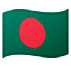
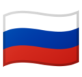
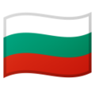
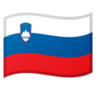
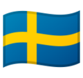
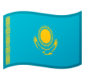
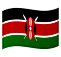
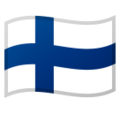

# Translations

|  | Translated Link |
| --- | --- |
|  | [ગુજરાતી](README.guj.md) |
|  | [हिन्दी](README.hi.md) |
|  | [मराठी](README.mr.md) |
|  | [മലയാളം](README.ml.md) |
|  | [తెలుగు](README.te.md) |
|   | [বাংলা](README.bn.md) |
|   | [தமிழ்](README.ta.md) |
|  | [မြန်မာ](README.mm_unicode.md) |
|  | [Bahasa Indonesia](README.id.md) |
|  | [Català](README.ca.md) |
|  | [Français](README.fr.md) |
|  | [Español](README.es.md) |
|  | [Nederlands](README.nl.md) |
|  | [Русский язык](README.ru.md) |
|  | [Bulgarian](README.bg.md) |
|  | [Македонски](README.mk.md) |
|  | [Magyar](README.hu.md) |
|  | [Slovenčina](README.slk.md) |
|  | [日本語](README.ja.md) |
|  | [Tiếng Việt](README.vn.md) |
|  | [Polski](README.pl.md) |
|  | [فارسی](README.fa.md) |
|  | [Persian_Finglish](README.fa.en.md) |
|  | [Lietuvių kalba](README.lt.md) |
|   | [한국어](README.ko.md) |
|   | [Deutsch](README.de.md) |
|   | [中文(Simplified)](README.chs.md), [中文(Traditional)](README.cht.md) |
|  | [ελληνικά](README.gr.md) |
| العربية | [العربية](README.ar.md) |
|  | [Українська](README.ua.md) |
|  | [Português (Brasil)](README.pt_br.md) |
|  | [Português (Portugal)](README.pt-pt.md) |
|  | [Italiano](README.it.md)
|  | [ภาษาไทย](README.th.md) |
| 󠁥󠁳󠁧󠁡󠁿 | [Galego](README.gl.md) |
|  | [नेपाली](README.np.md) |
|  | [اردو](README.ur.md) |
|   | [Limba Română](README.ro.md) |
|  | [English](../README.md) |
|  | [English (Pirate)](README.en-pirate.md) |
|  | [Türkçe](README.tr.md) |
|  | [עברית](README.hb.md) |
|  | [Bahasa Melayu / بهاس ملايو‎ / Malay](README.my.md) |
|  | [Czech](README.cs.md) |
|  | [Slovenščina](README.sl.md) |
|  | [Norsk](README.no.md) |
|  | [Svenska](README.se.md) |
|  | [Dansk](README.da.md) |
|  | [المصرية](README.eg.md) |
|  | [Wikang Filipino](README.tl.md) |
|  | [Қазақша](README.kz.md) |
|  | [Afrikaans (South Africa)](README.afk.md) |
|  | [Zulu (South Africa)](README.zul.md) |
|  | [Kiswahili (Kenya)](README.kws.md) |
|  | [ქართული](README.ge.md) |
|  | [Igbo (Nigeria)](README.igb.md) |
|  | [Suomeksi](README.fi.md) |
